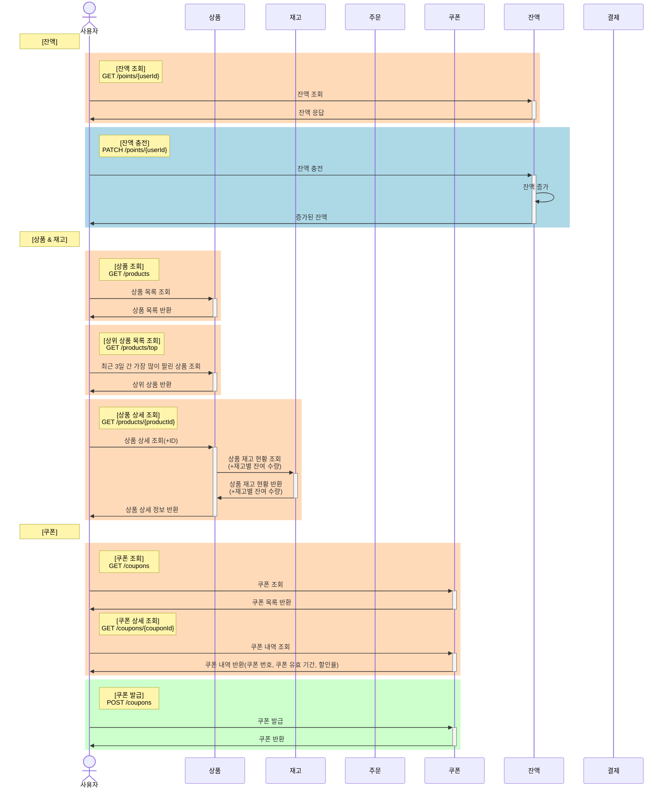
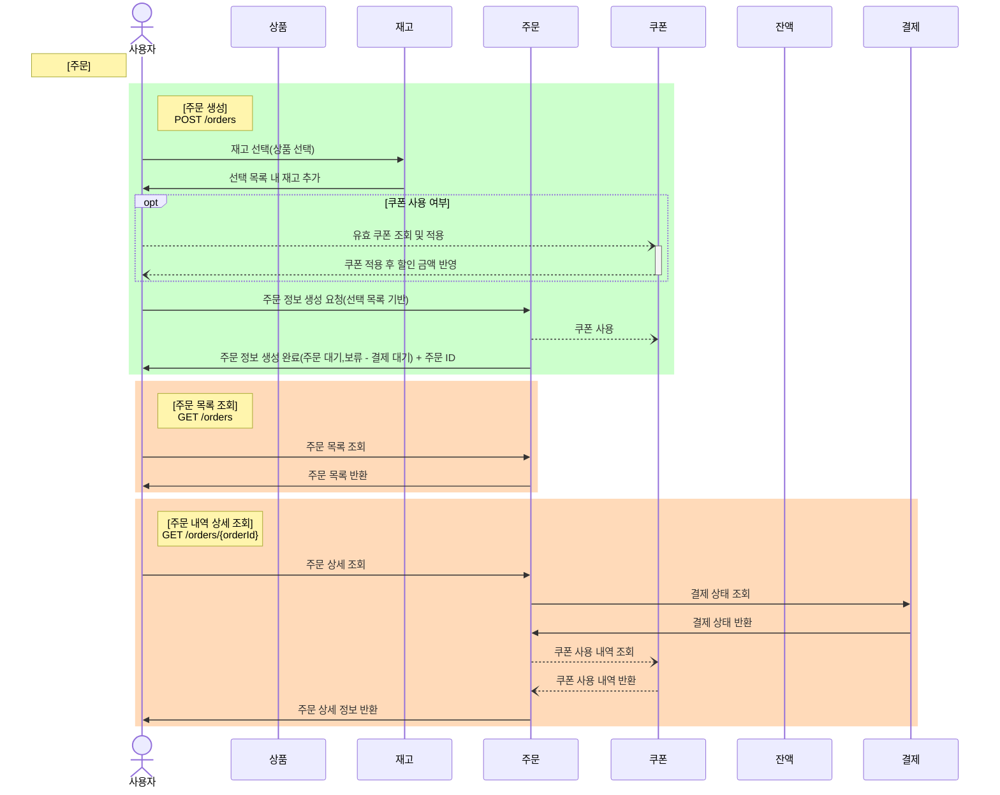
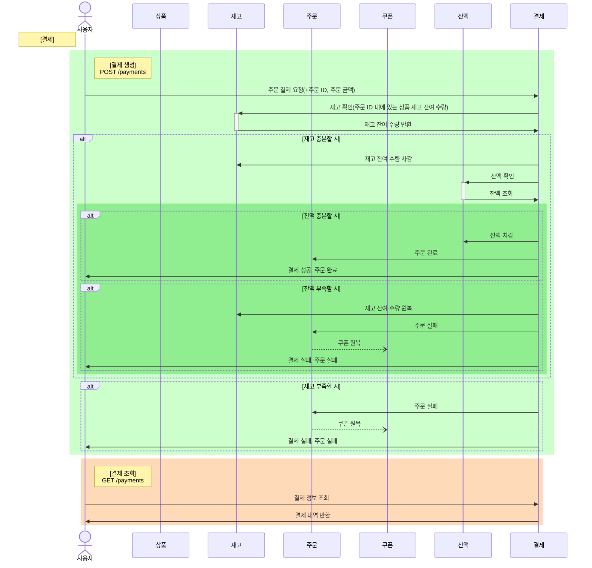

```mermaid
sequenceDiagram
    actor 사용자
    participant 상품
    participant 재고
    participant 주문
    participant 쿠폰
    participant 잔액
    participant 결제
    Note left of 사용자: [잔액]
    
    %% 잔액 내역 조회는 /points/{userId}/transactions/{pointId}
    %% /balance
    rect rgb(255, 218, 185)
        Note right of 사용자: [잔액 조회]<br/>GET /points/{userId}
        사용자 ->>+ 잔액: 잔액 조회
        잔액 ->>- 사용자: 잔액 응답
    end
    
    rect rgb(173, 216, 230)
    Note right of 사용자: [잔액 충전]<br/>PATCH /points/{userId}
        사용자 ->>+ 잔액: 잔액 충전
        잔액 ->> 잔액: 잔액 증가
        잔액 ->>- 사용자: 증가된 잔액
    end


    Note left of 사용자: [상품 & 재고]
    rect rgb(255, 218, 185)
        Note right of 사용자: [상품 조회]<br/>GET /products
        사용자 ->>+ 상품: 상품 목록 조회
        상품 ->>- 사용자: 상품 목록 반환
    end
    
    rect rgb(255, 218, 185)
        Note right of 사용자: [상위 상품 목록 조회]<br/>GET /products/top
        사용자 ->>+ 상품: 최근 3일 간 가장 많이 팔린 상품 조회
        상품 ->>- 사용자: 상위 상품 반환
    end

    rect rgb(255, 218, 185)
        Note right of 사용자: [상품 상세 조회]<br/>GET /products/{productId}
        사용자 ->>+ 상품: 상품 상세 조회(+ID)
        상품 ->>+ 재고: 상품 재고 현황 조회<br/>(+재고별 잔여 수량)
        재고 ->>- 상품: 상품 재고 현황 반환<br/>(+재고별 잔여 수량)
        상품 ->>- 사용자: 상품 상세 정보 반환
    end

    
    Note left of 사용자: [쿠폰]
    rect rgb(255, 218, 185)
        Note right of 사용자: [쿠폰 조회]<br/>GET /coupons
        사용자 ->>+ 쿠폰: 쿠폰 조회
        쿠폰 ->>- 사용자: 쿠폰 목록 반환
        Note right of 사용자: [쿠폰 상세 조회]<br/>GET /coupons/{couponId}
        사용자 ->>+ 쿠폰: 쿠폰 내역 조회
        쿠폰 ->>- 사용자: 쿠폰 내역 반환(쿠폰 번호, 쿠폰 유효 기간, 할인율)
    end
    rect rgb(204, 255, 204)
        Note right of 사용자: [쿠폰 발급]<br/>POST /coupons
        사용자 ->>+ 쿠폰: 쿠폰 발급
        쿠폰 ->>- 사용자: 쿠폰 반환
    end
```

```mermaid
sequenceDiagram
    actor 사용자
    participant 상품
    participant 재고
    participant 주문
    participant 쿠폰
    participant 잔액
    participant 결제
    
    Note left of 사용자: [주문]
    rect rgb(204, 255, 204)
        Note right of 사용자: [주문 생성]<br/>POST /orders
        사용자->>재고: 재고 선택(상품 선택)
        재고->>사용자: 선택 목록 내 재고 추가
        opt 쿠폰 사용 여부
            사용자--)+쿠폰: 유효 쿠폰 조회 및 적용
            쿠폰--)-사용자: 쿠폰 적용 후 할인 금액 반영
        end
        사용자->>주문: 주문 정보 생성 요청(선택 목록 기반)
        주문--)쿠폰: 쿠폰 사용
        주문->>사용자: 주문 정보 생성 완료(주문 대기,보류 - 결제 대기) + 주문 ID
    end

    rect rgb(255, 218, 185)
        Note right of 사용자: [주문 목록 조회]<br/>GET /orders
        사용자->>주문: 주문 목록 조회
        주문->>사용자: 주문 목록 반환
    end    

    rect rgb(255, 218, 185)
        Note right of 사용자: [주문 내역 상세 조회]<br/>GET /orders/{orderId}
        사용자->>주문: 주문 상세 조회
        주문->>결제: 결제 상태 조회
        결제->>주문: 결제 상태 반환
        주문--)쿠폰: 쿠폰 사용 내역 조회
        쿠폰--)주문: 쿠폰 사용 내역 반환
        주문->>사용자: 주문 상세 정보 반환
    end
```

```mermaid
sequenceDiagram
    actor 사용자
    participant 상품
    participant 재고
    participant 주문
    participant 쿠폰
    participant 잔액
    participant 결제    
    
    Note left of 사용자: [결제]
    rect rgb(204, 255, 204)
        Note right of 사용자: [결제 생성]<br/>POST /payments
        사용자->>결제: 주문 결제 요청(+주문 ID, 주문 금액)
        결제->>+재고: 재고 확인(주문 ID 내에 있는 상품 재고 잔여 수량)
        재고->>-결제: 재고 잔여 수량 반환
        alt 재고 충분할 시
            결제->>재고: 재고 잔여 수량 차감
            결제->>+잔액: 잔액 확인
            잔액->>-결제: 잔액 조회
            rect rgb(144, 238, 144)
                alt 잔액 충분할 시
                    결제->>잔액: 잔액 차감
                    결제->>주문 : 주문 완료
                    결제->>사용자: 결제 성공, 주문 완료
                end
                alt 잔액 부족할 시
                    결제->>재고: 재고 잔여 수량 원복
                    결제->>주문: 주문 실패
                    주문--)쿠폰: 쿠폰 원복
                    결제->>사용자 : 결제 실패, 주문 실패
                end
            end
        end
        alt 재고 부족할 시
            결제->>주문: 주문 실패
            주문--)쿠폰: 쿠폰 원복
            결제->>사용자: 결제 실패, 주문 실패
        end
    end
    rect rgb(255, 218, 185)
        Note right of 사용자: [결제 조회]<br/>GET /payments
        사용자->>결제: 결제 정보 조회
        결제->>사용자: 결제 내역 반환
    end
```
