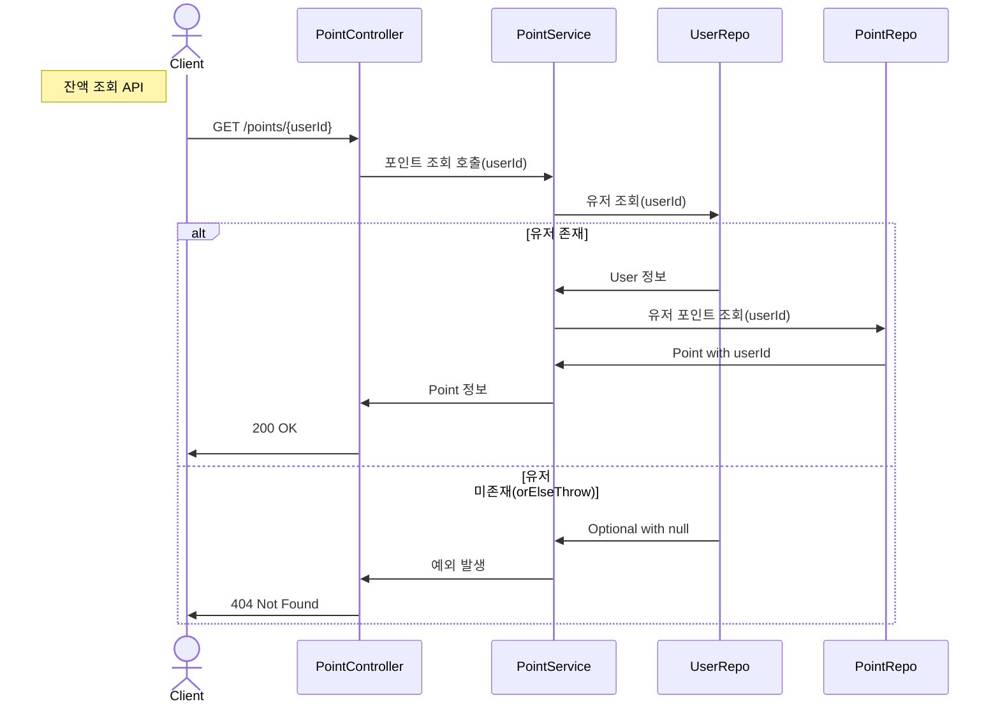
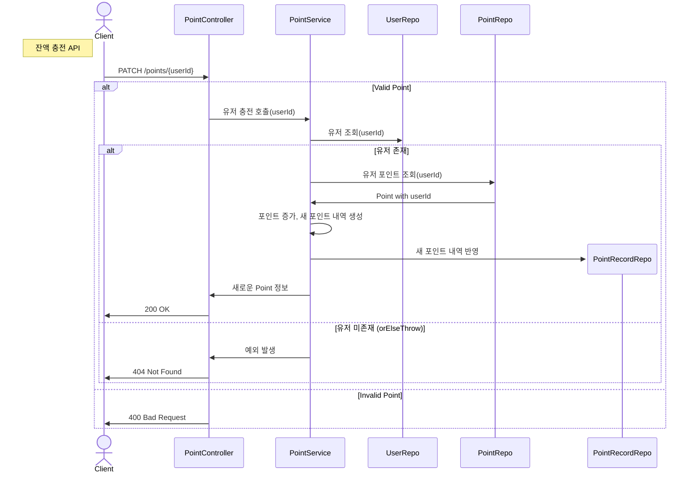
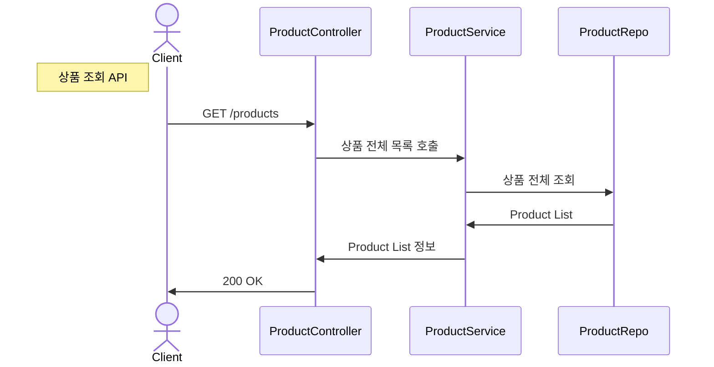
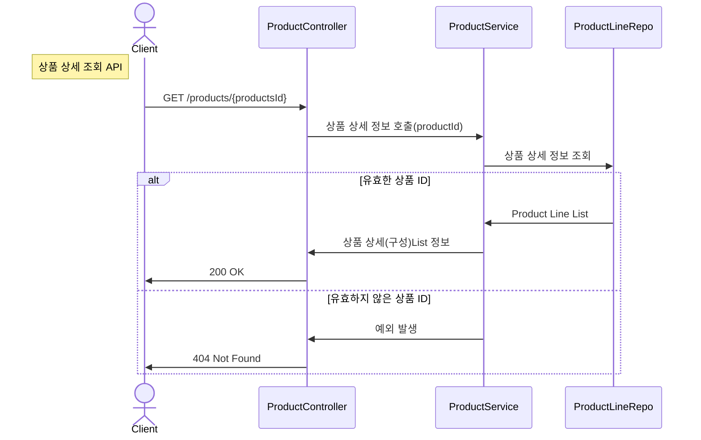
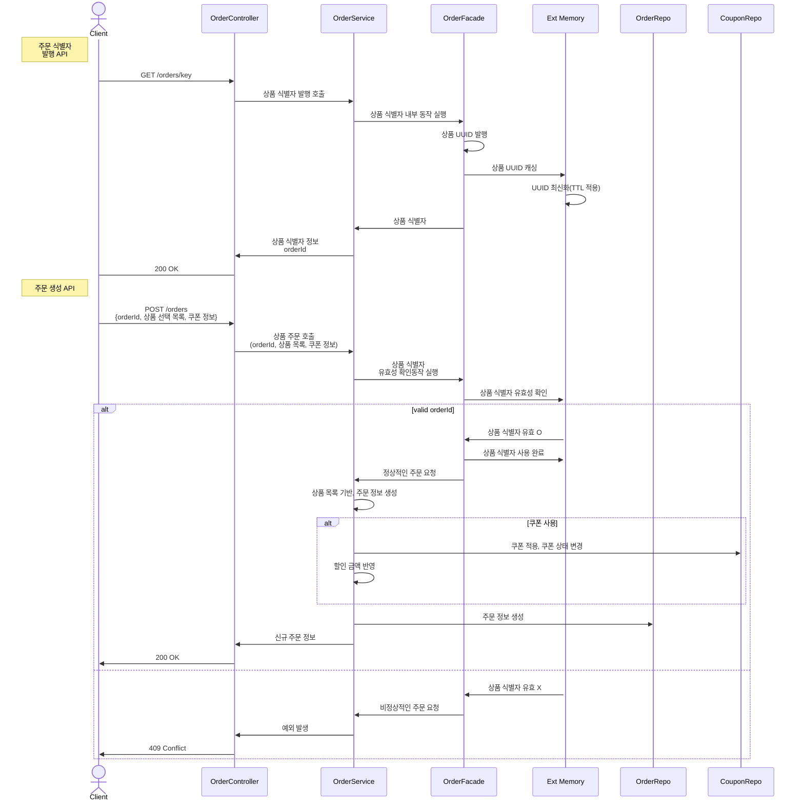
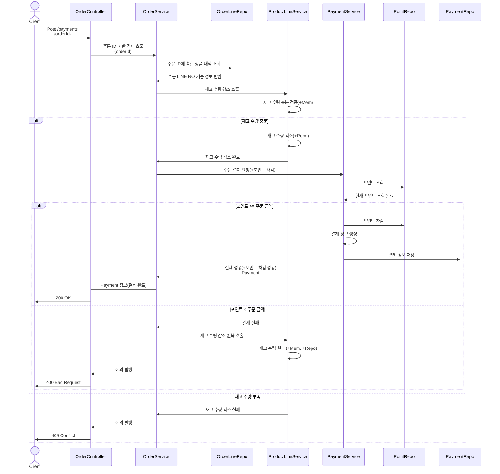
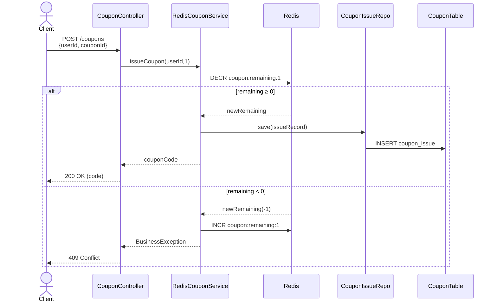
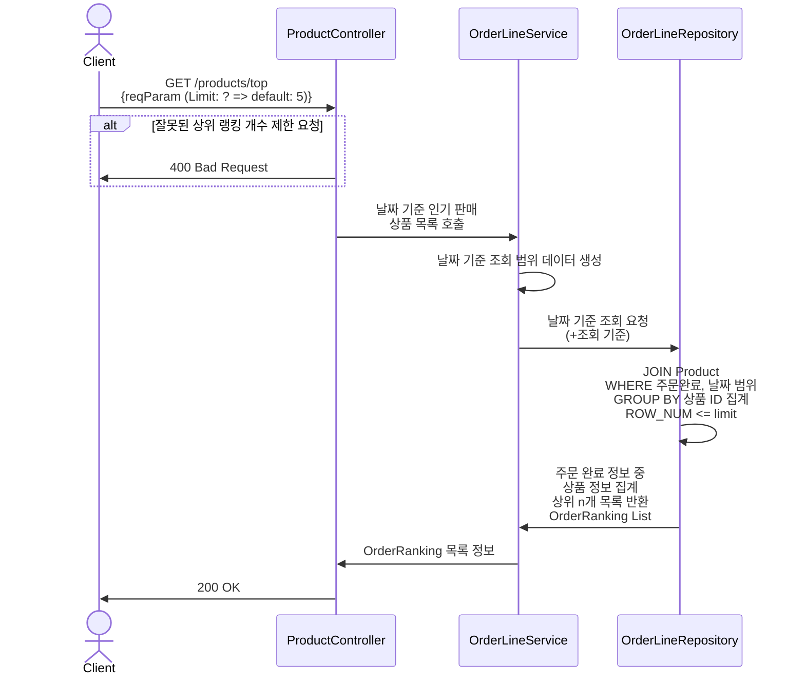

### 잔액 충전 / 조회 API

---

### 상품 조회 API

---
### 주문/결제 API

OrderFacde의 존재 이유
- 추후에, 레디스나 카프카를 도입할 경우에는 인-메모리 기반의 저장소가 존재하지만,
- 없다면? 나중에 OrderService의 내부에 코드 블럭을 수정/추가할 필요가 있을 것 같습니다.
- 그렇다면, OrderFacade을 두고서, 내부에 메모리 코드를 사용하는 로직을 작성한다면,(또는 Only True로 락 허용 가정)
- 추후에 레디스 or 카프카를 도입할 때가 되어, 해당 외부 메모리를 사용하는 실제 구현체로 대체 가능할 수 있다고 생각하였습니다.
- (Ext Memory은 레디스 or 카프카 또는 다른 캐싱 메모리 구조를 확장하기 위함)

---
### 선착순 쿠폰 API

### 인기 판매 상품 조회 API

