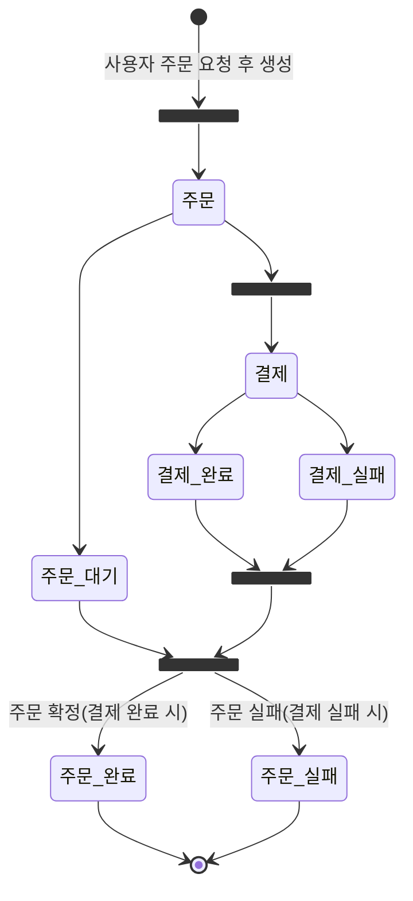

```mermaid
stateDiagram-v2
    state 주문_요청  <<fork>>
        [*] --> 주문_요청   : 사용자 주문 요청 후 생성
        주문_요청 --> 주문
        
        state 결제_요청 <<join>>
        주문 --> 결제_요청
        
        결제_요청 --> 결제
        결제 --> 결제_완료 
        결제--> 결제_실패
        state 결제_다음 <<join>>
        
        결제_완료 --> 결제_다음
        결제_실패 --> 결제_다음

        state 주문_다음 <<join>>    
        주문 --> 주문_대기
        주문_대기 --> 주문_다음
        
        결제_다음 -->주문_다음


        주문_다음 --> 주문_완료   : 주문 확정(결제 완료 시)
        주문_다음 --> 주문_실패   : 주문 실패(결제 실패 시)
        주문_완료-->[*]
        주문_실패-->[*]
        
        
```