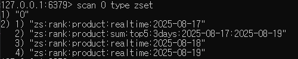

## 1. 인기상품 조회 Redis 활용 방안

### 1) 컨셉
- 기존 방식
  - 반드시 DB조회를 통해 캐시를 최신화 할 수 있고, 날짜가 변경 될 경우 반드시 DB Connection을 통한 집계 쿼리를 수행하여야 했습니다.
  - 또한, 실시간 데이터를 반영하기 위해선 캐시-DB간의 정합성을 보장하는 비용이 추가적으로 필요하였습니다.
- 변경 방식
  - Redis의 ZSET을 통해 집계 쿼리를 꼭 DB에 날리지 않고도, 순위를 나타낼 수 있었습니다.
  - 금일/지난 상품에 대한 주문 수량을 실시간으로 캐싱하여 더 빠른 성능을 가져갈 수 있었습니다.
   <br/><br/> 
  - 매일 실시간 인기 상품을 ZSET 자료구조를 활용
    - SCORE를 주문이 완료된 수량으로 지정하여, 빠르게 순위를 접근 가능함.
  - 당일 실시간 인기 상품을 하루 단위의 TTL이 아닌, 여러 일 수로 지정
    - 지난 N일간 인기 상품을 조회할 시에, ZSET의 UNION STORE 기능을 활용하여 집계 쿼리가 아닌 Redis 기반의 빠른 집계 순위를 제공 가능함.

---
### 2) 관련 Redis 명령어
```redis
ZUNIONSTORE zs:rank:product:sum:top5:3days:2025-08-15:2025-08-18 \
  zs:rank:product:realtime:2025-08-15 \
  zs:rank:product:realtime:2025-08-16 \
  zs:rank:product:realtime:2025-08-17 \
  AGGREGATE SUM

-- 
ZREVRANGE s:cache:rank:product:sum:top5:3days:2025-08-15:2025-08-18 0 4 WITHSCORES
```


---
### 3) 인기 상품 캐싱 MISS, HIT에 따른 동작
- 오늘 제외 지난 3일간의 인기상품 순위는 변하지 않으므로, (72시간으로 하지 않고 날짜 기준 으로 하였습니다.)
- 유저 지난 3일 상위 5개 인기상품 조회 시,
  - (rank 관련 순위 ZSET KEY)가 존재하지 않는다면,
    - DB에서 인기 상품 집계 정보 조회 후, Redis에 캐싱 및 rank ZSET 최신화
    - `zs:rank:product:sum:top5:3days:2025-08-15:2025-08-18` -> update
    - `s:cache:rank:product:sum:top5:3days:2025-08-15:2025-08-18` -> update

  - (rank 관련 순위 ZSET KEY)가 존재 한다면,
    - 인기 상품 캐시 데이터를 조회하여 유저에게 응답.
    - `s:cache:rank:product:sum:top5:3days:2025-08-15:2025-08-18` -> select
> 배치를 통해, 매일 00시에 지난 3일치에 대한 인기순위 데이터를 만들어 줄 수도 있었지만,   
> 최초 유저 조회 시에, 정보가 최신화 되도록 진행하였습니다.. <br/>
>
> => 해당 부분은, 최초 조회 되는 유저의 억울한(?) 성능 저하를 가져올 수 있으므로,,,
> 추후에 배치를 통해서 매일 00시에 최신화 되는 방식으로 변경이 꼭 필요합니다.


- 인기 상품 캐시 등록시 스탬피드 방지를 위해 `lock:s:cache:rank:product:sum:top5:3days` 키를 추가하였습니다.


### 4) 관련 코드
```java
public List<ProductLine> getTopProductItems(LocalDate start, LocalDate end){
    try{
        List<ProductLine> cached = productCacheRepo.findTop5RankFor3Days(start, end);
        if (cached != null) {
            return cached;
        }else{
            // 0.캐시 스탬피드 방지 락
            if(productCacheRepo.getLockForTop5RankFor3Days(start, end)){
                List<ProductRankingDto.ProductRankEntry> ranks = productCacheRepo.topFiveForThreeDaysZset();

                // 1. rank가 null 이라면, 주문 정보 기준 DB 조회 후 Cache 만들어주기
                if(ranks == null || ranks.isEmpty()){
                    List<TopOrderProductCommand.TopOrderProductResponse> topPlList = orderService.getTopOrderProduct(start, end);

                    List<ProductLine> topProductLines = topPlList.stream().map(
                            v -> productLineService.getProductLine(v.getProductLineId())
                    ).toList();

                    productCacheRepo.refreshThreeDaysZsetFromDb(start, end, topPlList);
                    productCacheRepo.saveTop5RankFor3Days(start, end, topProductLines);

                    return topProductLines;
                }
                // 2. rank가 null이 아니라면, 상품 정보 기준 DB 조회 후 상품 Cache 만들어 주기
                else{
                    List<ProductLine> topProductLines = ranks.stream().map(
                            rank -> productLineService.getProductLine(rank.productLineId())
                    ).toList();

                    productCacheRepo.saveTop5RankFor3Days(start, end, topProductLines);

                    return topProductLines;
                }
            }else{
                throw new NoSuchElementException("주문 상위 상품 Cache Miss.");
            }
        }
    }catch (Exception e){
        // 0-1. 캐시 스탬피드 락 획득 실패 후, 잠시 대기 후 재 조회
        try { Thread.sleep(50); } catch (InterruptedException ignored) {}
        List<ProductLine> warmed = productCacheRepo.findTop5RankFor3Days(start, end);
        if (warmed != null) return warmed;

        throw e;
    }

```