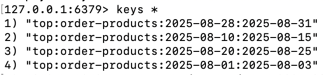

### 지난 3일간 인기 판매 상품 상위 5개 

- 매번 발생하는 집계 데이터를 실시간으로 DB에 쿼리를 날려 집계를 하는 것 보다,
- 기준 일을 정하고, 최초 조회 이후부터 변하지 않는 데이터를 기준으로 캐싱을 한다면,
- 유저가 일일이 조회 요청을 할 때마다 DB에서 연산이 오래 걸릴 확률이 있는 집계쿼리를 수행하지 않아도 되고,
- 캐싱을 통해 훨씬 더 빠른 시간 내에 응답을 생성하기 위해 작성하였습니다.



```java
public List<ProductLine> getTopProductItems(LocalDate start, LocalDate end){
        //LocalDate today = LocalDate.now();
        //LocalDate start = today.minusDays(3); // 오늘부터 -3일전
        //LocalDate end = today.minusDays(1); // 어제

        try{
            List<ProductLine> cached = productCacheRepo.find(start, end);
            if (cached != null) {
                return cached;
            }else{
                throw new NoSuchElementException("주문 상위 상품 Cache Miss.");
            }
        }catch (Exception e){
            //throw e;

            List<TopOrderProductCommand.TopOrderProductResponse> topPlList = orderService.getTopOrderProduct(start, end);

            List<ProductLine> topProductLines = topPlList.stream().map(
                    v -> {
                        return productLineService.getProductLine(v.getProductLineId());
                    }
            ).toList();

            productCacheRepo.save(start, end, topProductLines, ttlUntilMidnight());

            return topProductLines;
        }
    }
```

- TTL 설정은 다음날 자정이 되는 경우, 레디스 캐시에서 데이터가 삭제 되도록 설정하였습니다.
- (날짜가 하루 씩 지날 때 마다, 매일 기준이 달라지기 때문)
```java

    private Duration ttlUntilMidnight() {
        LocalDateTime now = LocalDateTime.now();
        LocalDateTime midnight = now.toLocalDate().plusDays(1).atStartOfDay();
        return Duration.between(now, midnight);
    }
```
---

### 500번 조회 시 비교
- 캐시를 저장하지 않고, DB에 계속 요청했을 때
- 캐시에 저장 후, 캐시 미스 시 DB 조회 요청 했을 때

<캐시 미사용>
```java
MISS: time=9008.28 ms, totalQ=3000 (select=3000, insert=0, update=0)
```

<캐시 사용>
```java
HIT: time=682.20 ms, totalQ=6 (select=6, insert=0, update=0)
```

주문에 대한 데이터를 100건 정도 만들어서, 진행하였는데도 DB커넥션에 대한 차이가 확연히 줄어든 것을 확인할 수 있었습니다.
(TestDataSourceProxy를 통해, QueryCount를 통한 쿼리 날린 횟수도 출력)