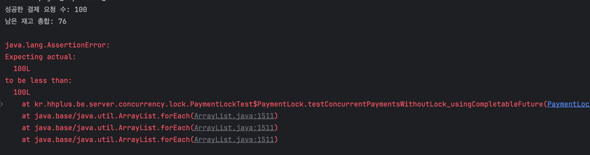
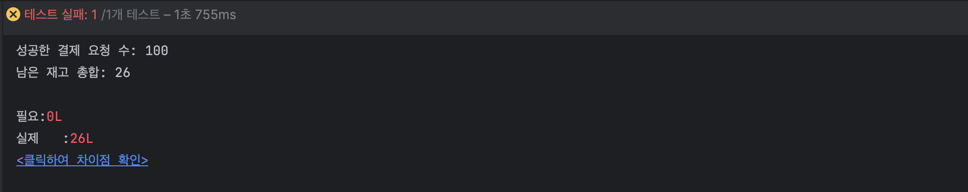
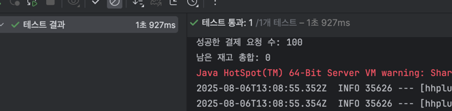

락 없이 결제 프로세스 실행 시, 재고 100 개 인, 상품을 1개의 주문으로 100명의 유저가 1번씩시도
하여서 재고 100 -> 0 이 되어야하는데, 재고가 여전히 남아있는 모습

```java
@Test
void 락_없이_결제_프로세스_실행() {
    int userCount = 100;
    ExecutorService executor = Executors.newFixedThreadPool(20);

    // 1번 상품라인에 대한 100개의 비동기 결제 요청
    List<CompletableFuture<Boolean>> futures =
            IntStream.rangeClosed(1, userCount)
                    .mapToObj(i -> CompletableFuture.supplyAsync(() -> {
                        try {
                            paymentFacade.process(new PaymentRequest("ORD-" + i));
                            return true;
                        } catch (Exception ex) {
                            return false;
                        }
                    }, executor))
                    .toList();

    // 모두 완료 대기
    CompletableFuture.allOf(futures.toArray(new CompletableFuture[0])).join();
    executor.shutdown();

    // 성공한 요청 수
    long successCount = futures.stream()
            .map(CompletableFuture::join)
            .filter(b -> b)
            .count();

    // 남은 재고 총합 (product_id = 1)
    List<ProductLine> lines = productLineService.getProductLineList(1L);
    long remainingTotal = lines.stream()
            .mapToLong(ProductLine::getRemaining)
            .sum();

    System.out.println("성공한 결제 요청 수: " + successCount);
    System.out.println("남은 재고 총합: " + remainingTotal);

    // 락 없이 동시성 문제가 있으면
    // successCount < 100, remainingTotal > (100 - successCount) 이 됩니다.
    assertThat(successCount).isLessThan(100);
    assertThat(remainingTotal).isGreaterThan(0);
}
}

```


> 락을 이용한 트랜잭션은, 조회와 수정이 같은 트랜잭션 레벨안에서 진행되어야 하는 것을 확인.

하지만 현재 내 PaymentFacade -> InventoryFacade를 기준으로 걸어놓았기 때문에,
트랜잭션 계층을 변경할 필요가 있음
( InventoryFacade -> ProductLineService(@Transaction)) -> 개별임
( InventoryFacade(@Transaction) -> ProductLineService) -> 업데이트되었던 모든 프로덕트 라인 롤백(복구 로직 필요 X)
근데 개별에서 다시 위로 올리면,,,,, 의미가 있나...?

다시 한번 해보기 

아래 두 클래스에 따라서, 복구로직에 의해 테스트 코드 실패/성공 여부 발생
```java
@Service
@RequiredArgsConstructor
public class InventoryFacade {
    private final ProductLineService productLineService;


    /** 주문 건 전체 재고가 충분한지 확인 (부족하면 예외) */
    //@Transactional
    public void checkStock(Order order) {
        List<OrderLine> succeededStockLines = new ArrayList<>();
        try{
            order.getOrderLines().forEach(line -> {
                ProductLine pl = productLineService.getProductLine(line.getProductLineId());
                pl.decreaseStock((long) line.getQuantity());  // domain 메서드 안에서 부족하면 OutOfStockeException
                productLineService.updateProductLine(pl);

                succeededStockLines.add(line); // 복구 로직 책임
            });
        }catch(OutOfStockException outEx) {
            // 복구 로직 - 5개중 4개만 업데이트 되었다면, 4개만 되돌리기?
            throw new RestoreOutOfStockException("재고 감소에 실패하였습니다.", succeededStockLines);
        }
    }
}

@Service
@RequiredArgsConstructor
public class ProductLineService {
    private final ProductLineRepository productLineRepository;

    public List<ProductLine> getProductLineList(Long productId){
        return productLineRepository.findByProductId(productId);
    }

    public ProductLine getProductLine(Long productId){
        return productLineRepository.findById(productId)
                .orElseThrow(() -> new NoSuchElementException("올바르지 않은 상품입니다"));
    }


    @Transactional
    public void updateProductLine(ProductLine product){
        productLineRepository.save(product);
    }

}
```

그렇다면,,, 감소 시키는 책임을 다른 곳으로 옮길 필요가 있는데,,,,


선택
InventoryFacade -> 로 트랜잭션 옮기기
이유 : 유즈케이스 관점에서 특정 재고를 조회하고, 감소하는 그 과정은 하나이기 때문
 
또한, 그렇게 할 경우 하나의 ProductLine에 대해 개별적 트랜잭션을 실행하지 않아도되고
원자성도 한번에 가져갈 수 있음.

-> 주문에 포함되어잇는 재고가 남아있는지 확인하고, 감소까지는 하나의 행위이니
하나의 트랜잭션으로 빼기

또한 개별로 하게되면 재고 원복에 대한 트랜잭션도 개별이기 때문에, db 커넥션이 늘어날 것임
-> 



```java
@Service
@RequiredArgsConstructor
public class ProductLineService {
    private final ProductLineRepository productLineRepository;

    public List<ProductLine> getProductLineList(Long productId) {
        return productLineRepository.findByProductId(productId);
    }

    public ProductLine getProductLine(Long productId) {
        // Step 09 : 비관적 락으로 수정
        return productLineRepository.findByIdWithPessimisticLock(productId)
                //productLineRepository.findById(productId)
                .orElseThrow(() -> new NoSuchElementException("올바르지 않은 상품입니다"));
    }
}

@Repository
public interface ProductLineJpaRepository extends JpaRepository<ProductLineJpaEntity, Long> {
    List<ProductLineJpaEntity> findProductLineJpaEntitiesByProductId(Long productId);

    @Lock(LockModeType.PESSIMISTIC_WRITE)
    @Query("select p from ProductLineJpaEntity p where p.productLineId = :id")
    Optional<ProductLineJpaEntity> findByIdForUpdate(@Param("id") Long plId);
}

@Service
@RequiredArgsConstructor
public class InventoryFacade {
    private final ProductLineService productLineService;


    /** 주문 건 전체 재고가 충분한지 확인 (부족하면 예외) */
    @Transactional
    public void checkStock(Order order) {
        List<OrderLine> succeededStockLines = new ArrayList<>();
        try {
            order.getOrderLines().forEach(line -> {
                ProductLine pl = productLineService.getProductLine(line.getProductLineId());

                pl.decreaseStock((long) line.getQuantity());  // domain 메서드 안에서 부족하면 OutOfStockeException
                productLineService.updateProductLine(pl);

                succeededStockLines.add(line); // 복구 로직 책임
            });
        } catch (OutOfStockException outEx) {
            // 복구 로직 - 5개중 4개만 업데이트 되었다면, 4개만 되돌리기?
            throw new RestoreOutOfStockException("재고 감소에 실패하였습니다.", succeededStockLines);
        }
    }
}
```
이렇게 하고 PaymentFacade 에서 복구 로직 제거!

기존 트랜잭션 테스트에서도 이상 없이 통과되는 모습