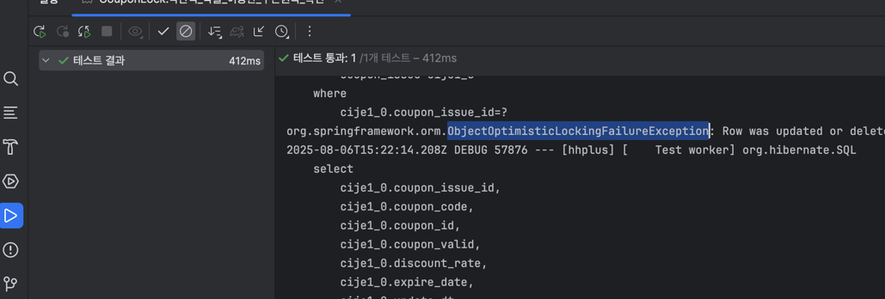
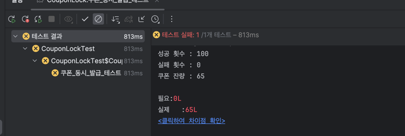
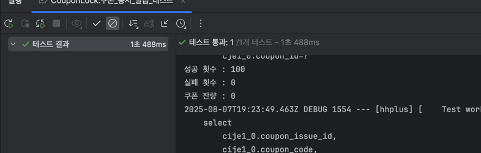

# 쿠폰 사용/발급 시 동시성 문제 해결

---
## [1] 쿠폰 사용 시 동시성 문제
### 1. 문제 식별
- 서로 다른 주문 에서, 동시에 같은 쿠폰을 사용한다면???
- 동시에 쿠폰 사용에 대한 요청이 들어온다면, 하나의 쿠폰이 여러 주문에 들어갈 수 있는 Race Condition이 발생할 우려가 있습니다.

---
### 2. 분석
- 유저가 사용할 수 있는 쿠폰은 본인 뿐 이므로, 본인이 사용한 쿠폰에 대해서 한 번만 요청이 가능하도록 낙관적 락을 고려해보기
- 주문 1 -> 쿠폰 A , 주문 2 -> 쿠폰 A
- 어느 주문이 성공하더라도, 나머지 한 주문에 대해서는 이미 사용한 쿠폰을 쓰려는 행위가 되므로, 클라이언트 측에서 재요청을 할 수 있도록 예외 처리
---
### 3. 해결
- CouponIssue 엔티티에 @Version 칼럼을 통한 낙관적 락 방식 추가하기

#### 3-1) 엔티티
```java
@Entity
@Table(name = "coupon_issue")
@Getter
@NoArgsConstructor
public class CouponIssueJpaEntity {
    @Id
    @GeneratedValue(strategy = GenerationType.IDENTITY)
    private Long couponIssueId;

    private String couponCode;
    private Long couponId;
    private Long userId;
    private String couponValid;
    private BigDecimal discountRate;
    private LocalDateTime expireDate;

    // Version 추가
    @Version
    @Column(
            nullable = false,
            columnDefinition = "BIGINT NOT NULL DEFAULT 0"
    )
    private Long version;

    @UpdateTimestamp
    @Column(
            name = "update_dt",
            nullable = false,
            columnDefinition = "DATETIME NOT NULL DEFAULT CURRENT_TIMESTAMP ON UPDATE CURRENT_TIMESTAMP"
    )
    private LocalDateTime updateDt;

    public CouponIssue toDomain() {
        return CouponIssue.builder()
                .version(version)
                .couponIssueId(this.couponIssueId)
                .couponCode(this.couponCode)
                .couponId(this.couponId)
                .userId(this.userId)
                .couponValid(this.couponValid)
                .discountRate(this.discountRate)
                .expireDate(this.expireDate)
                .updateDt(this.updateDt)
                .build();
    }

    public static CouponIssueJpaEntity fromDomain(CouponIssue issue) {
        CouponIssueJpaEntity e = new CouponIssueJpaEntity();
        if (issue.getCouponIssueId() != null) {
            e.couponIssueId = issue.getCouponIssueId();
        }
        e.couponCode    = issue.getCouponCode();
        e.couponId      = issue.getCouponId();
        e.userId        = issue.getUserId();
        e.couponValid   = issue.getCouponValid();
        e.discountRate  = issue.getDiscountRate();
        e.expireDate    = issue.getExpireDate();
        e.updateDt      = issue.getUpdateDt();
        e.version       = issue.getVersion();
        return e;
    }
}
```

#### 3-2) 도메인
```java
// 도메인 <-> 엔티티 변환 과정 중 version 필드가 Null이 되는 경우가 발생하여,, 임의로 추가하였습니다.
@Getter
@SuperBuilder
public abstract class VersionedDomain {
    @Builder.Default
    protected Long version = 0L;
}


@Data
@SuperBuilder
public class CouponIssue extends VersionedDomain {

    private Long couponIssueId;

    private String couponCode;
    private Long couponId;
    private Long userId;
    private String couponValid;
    private BigDecimal discountRate;
    private LocalDateTime expireDate;
    private LocalDateTime updateDt;
}
```

#### 3-3) 낙관적 락 조회 (Jpa Repo)
```java
@Repository
public interface CouponIssueJpaRepository extends JpaRepository<CouponIssueJpaEntity, Long> {
    @Lock(LockModeType.OPTIMISTIC)
    @Query("SELECT c FROM CouponIssueJpaEntity c WHERE c.couponCode = :code")
    Optional<CouponIssueJpaEntity> findByCouponCodeWithLock(@Param("code") String code);
}
```

#### 3-4) 쿠폰 사용 코드 (서비스)
> 해당 코드들을 주문 퍼사드에서 @Transactional이 붙은 함수에서 호출 합니다.
```java
public CouponIssue getCouponIssue(Long userId, String couponCode){
        if(couponCode.isEmpty() || couponCode.isBlank()){
            return null;
        }

        CouponIssue ci = couponIssueRepository.findByCouponCode(couponCode)
                .orElseThrow(() -> new InvalidCouponException(couponCode)); // 낙관적 락 조회

        if(!Objects.equals(userId, ci.getUserId()) || !ci.isValid()){
            throw new InvalidCouponException(couponCode);
        }
        return ci;
    }

    public CouponIssue couponAppliedByOrder(Long userId, String cCode){
        if(cCode.isEmpty() || cCode.isBlank()){
            return null;
        }

        CouponIssue ci = getCouponIssue(userId, cCode);
        ci.setCouponValid("N");

        couponIssueRepository.save(ci);

        return ci;
    }
```

---
### 4) 결과
한 쿠폰을 동시에 두번 요청 시에, `ObjectOptimisticLockingFailureException` 이 발생하는 것을 통해 낙관적락이 정상 동작하는 것을 확인할 수 있었습니다.



---

## [2] 쿠폰 발급 시 동시성 문제

### 1. 문제 식별
- 쿠폰 발급 가능 수 제한이 있을 경우, 여러 번의 쿠폰 발급 요청 시 조회 시점과 수정시점이 동기화 되지 않을 경우 Race Condition이 일어날 우려가 있습니다.

---
### 2. 분석
- 낙관적 락을 한다면?
  - 클라이언트 측 재시도
    1) 한 유저가 쿠폰을 발급하려 하였으나, 수정 시점에 버전이 상이하여 쿠폰 발급에 실패함
    2) 클라이언트 측에서 재시도 하라고 예외를 던짐
    3) 선착순 쿠폰 개수가 아직 유효한데도 재시도를 해야하는 것은 기능 요구사항에 적절하지 않음
    4) 또는, 재시도 과정 중에 다른 유저들의 쿠폰 발급으로 인해 쿠폰을 발급할 수 있었음에도,, 소진 될 수 있음..
  - 서버 측 재시도
    1) 한 유저가 쿠폰을 발급하려 하였으나, 수정 시점에 버전이 상이하여 쿠폰 발급에 실패함
    2) 쿠폰 발급을 위해 재시도를 하였지만, 재시도 과정 중 다른 유저들의 쿠폰 발급으로 인해 소진 될 수 있음...


- 비관적 락을 한다면?
  - 현재 쿠폰이 발급 중이라면, 비관적 락을 얻기 위해 대기 하였다가 락 해제 시에 발급 로직을 수행 가능함.
  - 락을 얻는 시점은 아직 명확하게 기능구현을 하진 않았지만, 락을 얻고 난다면 실패할 확률이 현저히 낮음.
---
### 3. 해결
- Coupon 엔티티를 비관적락으로 조회하여 수량 감소 시키기.

#### 3-1) 비관적 락 조회 (Jpa Repo)
```java
@Repository
public interface CouponJpaRepository extends JpaRepository<CouponJpaEntity, Long> {
    @Lock(LockModeType.PESSIMISTIC_WRITE)
    @Query("SELECT c FROM CouponJpaEntity c WHERE c.couponId = :cId")
    Optional<CouponJpaEntity> findByIdForUpdate(@Param("cId") Long cId);
}
```

#### 3-2) 쿠폰 발급 코드 (서비스)
```java
@Service
@RequiredArgsConstructor
public class CouponService {
    private final CouponRepository couponRepository;
    private final CouponIssueRepository couponIssueRepository;
    private final CouponCodeGenerator codeGenerator;

    @Transactional
    public CouponIssue newCouponIssue(Long userId, Long couponId) {
        Coupon coupon = couponRepository.findByIdWithPessimisticLock(couponId) // 비관적 락 조회
                //couponRepository.findById(couponId)
                .orElseThrow(() -> new NoSuchElementException("존재하지 않는 쿠폰입니다."));

        // 쿠폰이 스스로 발급 로직을 수행 → 남은 수량 감소, CouponIssue 생성
        CouponIssue issue = coupon.issueTo(userId, codeGenerator);

        // 변경된 coupon, 발급된 issue 둘 다 저장
        couponRepository.save(coupon);
        return couponIssueRepository.save(issue);
    }
}
```

---

### 4) 결과
> `100개 쿠폰 100명 유저 발급 요청`
- 비관적 락 사용 전 



- 비관적 락 사용 후

