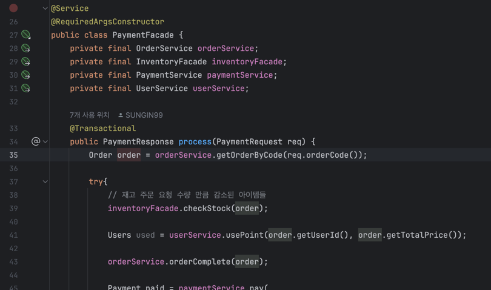

PaymentFacade.process()에 트랜잭션을 작성할 시에,
도메인 레벨에서의 재고 부족시, 트랜잭션 범위를 상위 클래스에서 내포하기 때문에,
이미 재고 감소된 상품라인의 remaining이 rollback되었지만,,

하위 계층의 서비스에 @Transactional을 붙히니, 
상품 3개 중 2개는 재고 감소가 올바르게 되었지만, 나머지 한 개가 재고가 부족하다면 예외가 발생하는데,

여기서 나머지 2개에 대한 @Transactional이 이미 수행되고 난 상태라, 트랜잭션의 범위가 단독적으로 실행됨..

```java
@Service
@RequiredArgsConstructor
public class InventoryFacade {
    private final ProductLineService productLineService;


    /** 주문 건 전체 재고가 충분한지 확인 (부족하면 예외) */
    public void checkStock(Order order) {
        order.getOrderLines().forEach(line -> {
            ProductLine pl = productLineService.getProductLine(line.getProductLineId());
            pl.decreaseStock((long) line.getQuantity());  // 여기서 문제
            productLineService.updateProductLine(pl);
        });
    }

    /** 체크 후 실패했을 때 롤백용 원복 */
    public void restoreStock(Order order) {
        order.getOrderLines().forEach(line -> {
            ProductLine pl = productLineService.getProductLine(line.getProductLineId());
            pl.increaseStock((long) line.getQuantity());
            productLineService.updateProductLine(pl);
        });
    }
}
```


```java
@Service
@RequiredArgsConstructor
public class ProductLineService {
    private final ProductLineRepository productLineRepository;

    public List<ProductLine> getProductLineList(Long productId){
        return productLineRepository.findByProductId(productId);
    }

    public ProductLine getProductLine(Long productId){
        return productLineRepository.findById(productId)
                .orElseThrow(() -> new NoSuchElementException("올바르지 않은 상품입니다"));
    }


    @Transactional
    public void updateProductLine(ProductLine product){
        productLineRepository.save(product);
    }

}
```

---

PaymentFacade 예외 처리 책임 분리

#### 초기 코드

```sql
@Service
@RequiredArgsConstructor
public class PaymentFacade {
    private final OrderService orderService;
    private final InventoryFacade inventoryFacade;
    private final PaymentService paymentService;
    private final UserService userService;

    public PaymentResponse process(PaymentRequest req) {
        Order order = orderService.getOrderByCode(req.orderCode());
        try{
            // 재고 주문 요청 수량 만큼 감소된 아이템들
            inventoryFacade.checkStock(order);

            Users used = userService.usePoint(order.getUserId(), order.getTotalPrice());

            orderService.orderComplete(order);

            Payment paid = paymentService.pay(
                    order.getUserId(),
                    order.getOrderId(),
                    order.getTotalPrice()
            );

            return new PaymentResponse(
                    paid.getPaymentId(),
                    paid.getOrderId(),
                    paid.getTotalPrice(),
                    paid.getPaymentDt().toString(),
                    paid.getStatus()
            );
        }catch(OutOfStockException outEx){
            // 복구 로직 - 5개중 4개만 업데이트 되었다면, 4개만 되돌리기?

            throw outEx;
        }catch (InsufficientBalanceException ex){
            // 복구 로직
            //inventoryFacade.restoreStock(order);
            throw ex;
        }
    }

}
```

개수 복구 책임 inventoryFacade로 옮기기
```java
@Service
@RequiredArgsConstructor
public class InventoryFacade {
    private final ProductLineService productLineService;


    /** 주문 건 전체 재고가 충분한지 확인 (부족하면 예외) */
    public void checkStock(Order order) {
        List<OrderLine> succeededStockLines = new ArrayList<>();
        try {
            order.getOrderLines().forEach(line -> {
                ProductLine pl = productLineService.getProductLine(line.getProductLineId());
                pl.decreaseStock((long) line.getQuantity());  // domain 메서드 안에서 부족하면 OutOfStockeException
                productLineService.updateProductLine(pl);

                succeededStockLines.add(line); // 복구 로직 책임
            });
        } catch (OutOfStockException outEx) {
            // 복구 로직 - 5개중 4개만 업데이트 되었다면, 4개만 되돌리기?
            restoreStock(succeededStockLines, 0);
        }
    }

    public void restoreStock(List<OrderLine> lines, int var) {
        lines.forEach(line -> {
            ProductLine pl = productLineService.getProductLine(line.getProductLineId());
            pl.increaseStock((long) line.getQuantity());
            productLineService.updateProductLine(pl);
        });
    }
}
```

하지만, 이러면 포인트가 부족할때는 다시한번더 restoreStock을 호출해줘야하는데,,,
이럴 경우 포인트 서비스에서 해당 함수를 호출하는거는 매우 안좋은,,, 행태가 될것

그렇다면,,, paymentFacade에서 OutofStockException을 처리하고, 성공한 녀석들을 다시 받는형태로 진행한후에
InsufficientBalance 에 대한 예외처리도하는것이 맞을것같음.


#### 수정완료

```
public PaymentResponse process(PaymentRequest req) {
    Order order = orderService.getOrderByCode(req.orderCode());
    try{
        // 재고 주문 요청 수량 만큼 감소된 아이템들
        inventoryFacade.checkStock(order);

        Users used = userService.usePoint(order.getUserId(), order.getTotalPrice());

        orderService.orderComplete(order);

        Payment paid = paymentService.pay(
                order.getUserId(),
                order.getOrderId(),
                order.getTotalPrice()
        );

        return new PaymentResponse(
                paid.getPaymentId(),
                paid.getOrderId(),
                paid.getTotalPrice(),
                paid.getPaymentDt().toString(),
                paid.getStatus()
        );
    }catch(RestoreOutOfStockException restEx){
        // 복구 로직 - 5개중 4개만 업데이트 되었다면, 4개만 되돌리기?
        inventoryFacade.restoreStock(restEx.getSucceededLines(), 0);
        throw new IllegalStateException("재고가 부족하여 결제에 실패하였습니다.");
    }catch (InsufficientBalanceException ex){
        // 복구 로직
        inventoryFacade.restoreStock(order.getOrderLines(), 0);
        throw new IllegalStateException("잔고가 부족하여 결제에 실패하였습니다.");
    }
}

public void checkStock(Order order) {
    List<OrderLine> succeededStockLines = new ArrayList<>();
    try{
        order.getOrderLines().forEach(line -> {
            ProductLine pl = productLineService.getProductLine(line.getProductLineId());
            pl.decreaseStock((long) line.getQuantity());  // domain 메서드 안에서 부족하면 OutOfStockeException
            productLineService.updateProductLine(pl);

            succeededStockLines.add(line); // 복구 로직 책임
        });
    }catch(OutOfStockException outEx) {
        // 복구 로직 - 5개중 4개만 업데이트 되었다면, 4개만 되돌리기?
        throw new RestoreOutOfStockException("재고 감소에 실패하였습니다.", succeededStockLines);
    }
}

```

---

포인트 원복은 자체적으로 트랜잭션을 통해 원복할 것으로 추정
```java
@Transactional
    public Users usePoint(Long userId, Object amount){
        PointDao point = getPoint(userId);
        // more : 포인트 레포 적용 코드

        Users user = getUser(userId);
        user.pointUse(amount);
        userRepository.save(user);

        point.setBalance(user.getBalance());
        pointRepository.save(point);

        return user;
    }

```