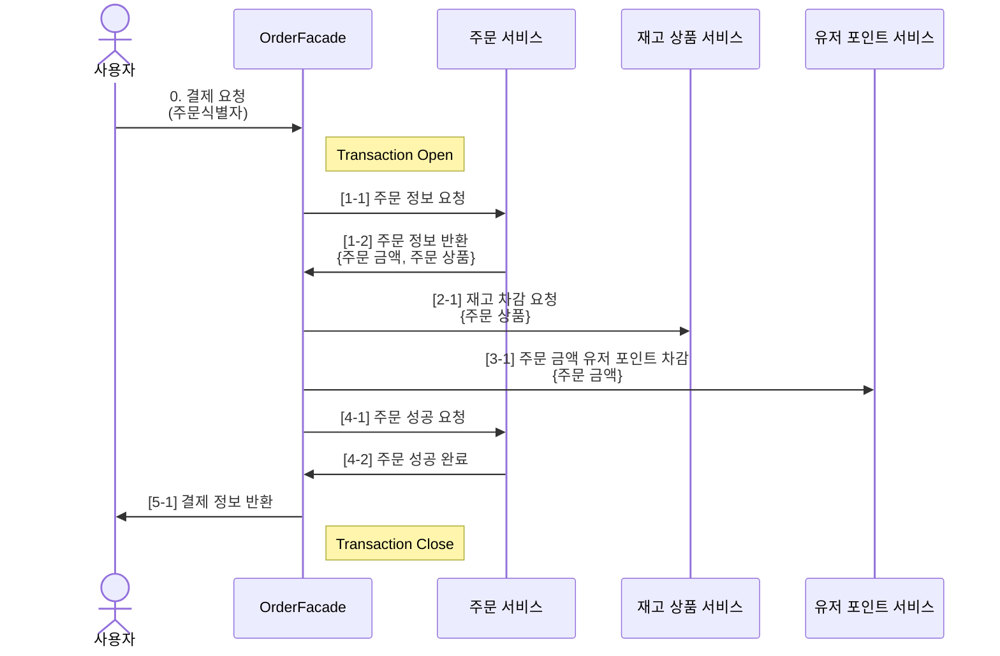
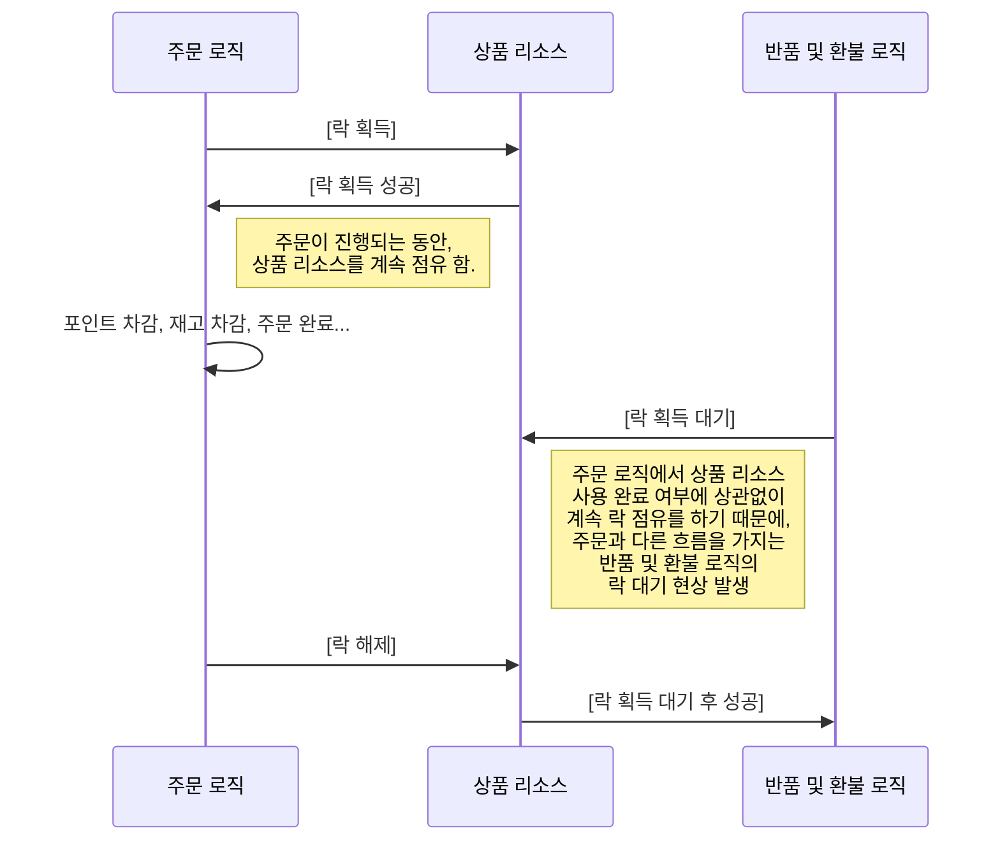
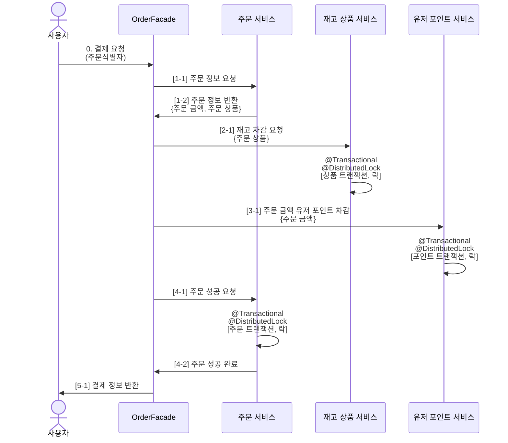
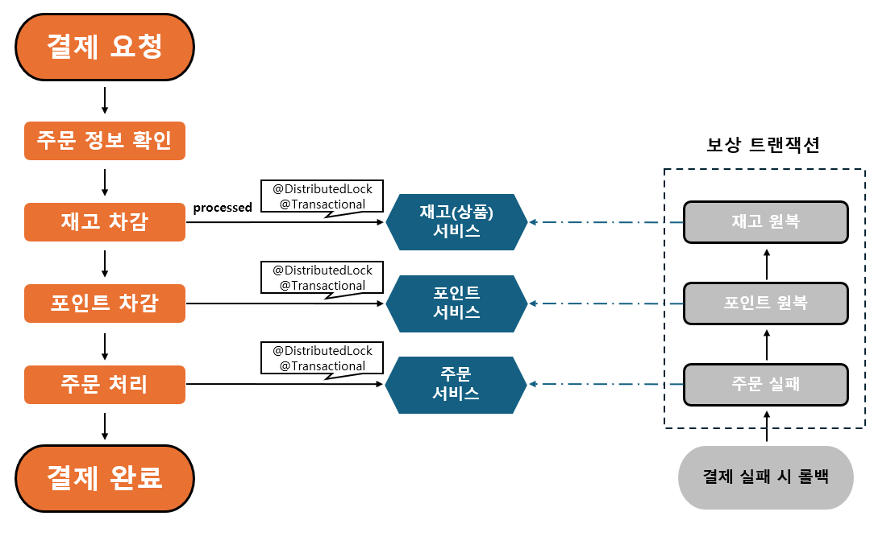
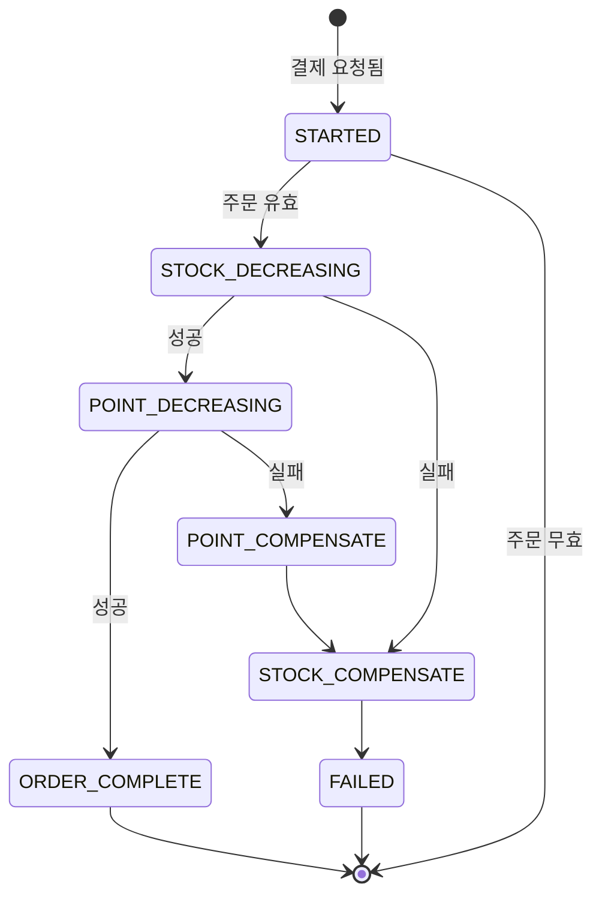

# [8주차] Transaction Diagnosis

> 서비스의 확장에 따라 어플리케이션 서버와 DB를 도메인별로 분리했을때, 트랜잭션 처리의 한계와 대응 방안

- 목차
  - [1] 현재 프로젝트의 우려사항
  - [2] 해결 방안 설계
  - [3] 해결 방안 문제점
  - [4] 해결 방안 구현
  - [5] 추후 확장 방향
---

## [1] 현재 프로젝트의 우려사항

### 1. 트랜잭션 문제
- 현재 프로젝트(e-commerce)내, 주문 도메인에서 다른 도메인의 여러 트랜잭션을 통한 결제 진행 중.


> 위와 같은 구조에서 `트랜잭션` 관리는 모두 OrderFacade 에서 담당을 하며, 각 도메인에 요청하는 주문 결제 과정 중 예외 발생시 롤백을 호출부에서 담당하여, 큰 트랜잭션 흐름을 가져가고 있습니다.
- 발생 가능한 예외
  - `OutOfStockException` : 상품 재고 부족 
  - `InsufficientBalanceException` : 유저 포인트 잔고 부족
  - `AlreadyProcessedPointException` : 이미 차감된 포인트
  - `AlreadyProcessedOrderException` : 이미 처리된 주문
<br/><br/>
- 현재 구조 
  - 각각의 트랜잭션을 분리하지 않음.
  - 호출부(OrderFacade)에서 전체 트랜잭션을 관장하는 구조
  - 서비스의 확장에 따라 한 비즈니스 로직에 매우 큰 트랜잭션의 범위 및 부담 발생 우려
    <br/><br/>
- 그로 인한 문제 
  - 분산 서비스 환경에서 각각의 도메인 리소스에 락이 필요한 경우
  - 트랜잭션이 진행되는 동안 해당 리소스의 락을 지속적으로 가짐.
  - 각 서비스간의 지연율을 일으킬 가능성 존재
 

### 2. 한 트랜잭션 내, 다중 락 관리
- 큰 트랜잭션의 흐름에서 여러 리소스에 대한 락을 한 번에 관리 하게 된다면, 서비스 내에 다른 로직에서 특정 도메인에 대한 자원의 별도 락이 필요한 경우, 관계가 없는 리소스에 의한 락 대기 현상을 유발합니다.
- ex
  - 주문이 이뤄지는 동안, 재고 정보가 업데이트 된다면?
  - 어떤 한 유저가 특정 상품에 대해서 주문 중일 때, 다른 유저는 해당 상품을 환불 한다면?


> 위와 같은 상황 처럼, 서로 다른 흐름을 갖는 비즈니스 로직이 각각의 동작을 수행하기 위해서,
> <br/>락을 획득하고자 하는 리소스가 겹칠 경우 트랜잭션과 락이 적절히 분리되지 않으면,
> <br/> 다중 락/분산 트랜잭션의 역할이 서비스 내에서 올바르게 수행되지 못합니다. 

---

## [2] 해결 방안 설계

1. 각각의 다중 락을 도메인 단위로 쪼개어, 분산 락의 형태로 책임을 나눠 가질 필요가 있습니다.
> 특정 로직에서 해당 리소스 사용 완료 시, 다른 로직에서도 해당 리소스를 적극적으로 활용 가능하도록 하기 위함.

2. 위와 같이 기존의 큰 트랜잭션 내에서 분산 락을 쪼개게 된다면, 트랜잭션 내부에서 락을 획득하는 하는 형태가 될 것 입니다. (절대 지양 해야하는 형태, Never)
> 그러므로, 락과 함께 트랜잭션 또한 분산하여 각각의 도메인 서비스의 트랜잭션이 시작 되기 전,<br/>
       리소스 접근에 필요한 락을 적절히 획득함으로서, 서로의 트랜잭션과 리소스에 간섭하지 않고 원자성을 보장할 수 있는 구조를 가져가야합니다. 

3. 분산 트랜잭션 및 분산 락

--- 
## [3] 해결 방안 문제점 및 고려 사항

### 문제점
- 각각의 트랜잭션과 락을 서비스 별로 분리함으로 인해, 만일 주문 과정 중에서 도중에 예외가 발생한다면, 호출부에서 전체 트랜잭션을 관장하지 못하기 때문에 이를 관리해줄 방법이 필요합니다.

### 고려 사항
- 앞서 발생 가능한 예외 목록에서, 예외 발생 시 트랜잭션 롤백한 것과 같은 결과를 보장하기 위해 `보장 트랜잭션` 구조를 띄어야 합니다.
  ```
  > 주문 로직이 수행되는 흐름에 따라, 보상 로직이 필요한 순서를 나열하면
  
  1. 재고 차감
    - 재고 부족할 시, 재고 수량 감소에 대한 롤백이 내부 트랜잭션에서 이뤄짐
  2. 포인트 차감
    - 포인트 부족할 경우, 앞선 "재고 차감"의 트랜잭션이 완료된 상태이기 때문에 
      재고 수량을 원복하는 보상 트랜잭션 추가 필요
  3. 주문 상태 성공
    - 주문이 결제 가능한 상태가 아니라면, 앞선 "재고 차감", "포인트 차감"에 대한
      정보를 원복하는 보상 트랜잭션 추가 필요
  ```

- 위와 같은 구조를 가져가기 위해, 각각의 서비스가 수행되는 동작을 유저 입장에서 하나의 흐름처럼 진행되는 것이 가능해야합니다.
- `오케스트레이터(Orchestrator)`를 도입하여, 한 흐름에 필요한 여러 서비스를 조합 및 관리 해주는 형태로 `정상 처리`, `보상 트랜잭션`에 대한 동작을 구현할 필요가 있습니다. 

- 이를 보장하는 `코레오그레피(Coreography)`, `사가(Saga)` 와 같은 두 가지 방법 중 저는 `사가(Saga)` 패턴을 채택 하였습니다.

### 사가 패턴(Saga)
- 코레오 그래피를 통해 비동기적으로, 각각의 이벤트를 통해 다음 서비스의 행동을 보장하는 구조도 좋지만,
  - 이는, 중간의 이벤트 유실 또는 이벤트를 미처 처리하지 못했을 때 다른 서비스에 대한 보상 동작을 트리거 시켜야하는 비용이 발생할 것이라고 생각했습니다.
  - (이를 해결하기 위한 더 좋은 방법도 굉장히 많지만!)


> 그러므로, 현재 구조에서는
- 사가 패턴을 통해 동기적인 흐름 속에서 현재 주문이 진행되는 상태를 관리하는 `상태머신`으로 둘 것 입니다.
- 이 `상태머신`을 기반으로  예기치 못한 동작으로 인해, 주문을 할 수 없는 예외 발생 시 문제 지점을 조금 더 수월하게 파악할 수 있을 것 입니다.
- 정해진 순서대로 `보상 트랜잭션`을 늘 일정하게 수행할 수 있는 `오케스트레이션형 사가`를 통해, 주문 프로세스를 구현하는 방식으로 락을 사용하는 이유를 명확하고, 분산 트랜잭션을 보장할 수 있는 구조를 가져기 위해 `사가(Saga)` 패턴을 채택 하였습니다.


- `사가(Saga)` 구조 및 `보상 트랜잭션(롤백)` 구조



- `사가(Saga)` 상태 머신
> 성공: `STARTED` → `STOCK_DECREASING` → `POINT_DECREASING` → `COMPLETED`<br/>
> 롤백: `STARTED` → `COMPENSATING` → `COMPENSATED` → `FAILED`



---

## [4] 해결 방안 구현

- 위 `사가(Saga)` 패턴 구조를 클래스를 통해서 아래와 같이 구현하였습니다.
- 상태 머신에 따른, `compensate()` 함수를 통해, 항상 복구 로직을 일정하게 수행할 수 있는 보상 트랜잭션 또한 코드로 작성하였습니다.

### OrderSaga.java (분산 트랜잭션 적용 후)
```java
public enum OrderState {
    STARTED("결제 시작"),
    STOCK_DECREASING("재고 차감 중"),
    STOCK_COMPENSATE("재고 원복 중"),
    POINT_DECREASING("포인트 차감 중"),
    
    COMPLETED("주문 완료"),
    COMPENSATING("보상 트랜잭션 수행 시작"),
    
    COMPENSATED("보상 트랜잭션 완료"),
    FAILED("주문 실패");
  
    private final String description;
  
    OrderState(String description) {
      this.description = description;
    }
  
    public String getDescription() {
      return description;
    }
}
```

```java
public class OrderSaga {

    private final Order order;
    private final List<Long> productLineIds;
    private final StockService stockService;
    private final PointService pointService;
    private final OrderRepository orderRepository;

    private OrderState state;

    public Order start(){
        try{
          // 주문 상태 확인
          order.isPending();
          transition(OrderState.STARTED);
    
          // 1. 재고 주문 요청 수량 만큼 감소된 아이템들
          transition(OrderState.STOCK_DECREASING);
          inventoryFacade.checkStockWithLock(order, productLineIds);
    
          // 2. 유저 포인트 차감
          transition(OrderState.POINT_DECREASING);
          Users used = userService.payPointWithLock(
                  order.getUserId(),
                  order.getTotalPrice(),
                  order.getOrderCode()
          );
    
          // 3. 주문 상태 변경
          transition(OrderState.PROCESSING);
          return orderService.orderComplete(order);
    
        }catch (Exception ex){
          compensate(ex);
          throw ex;
        }
    }
  
    private void compensate(Exception ex){
        OrderState lastState = state;

        // todo : 추후 이벤트 기반 보상 트랜잭션 작동 예정
        transition(OrderState.COMPENSATING);
        switch(lastState){
          case PROCESSING -> {
            // 주문 상태 변경 중  실패
            // → 포인트 환불
            // → 재고 원복
            transition(OrderState.FAILED);
            userService.chargePointWithLock(order.getUserId(), order.getTotalPrice(), order.getOrderCode());
            inventoryFacade.restoreStockWithLock(order, productLineIds);
          }
          case POINT_DECREASING -> {
            // 포인트 차감 중 실패
            // → 포인트 환불
            // → 재고 원복 (@Transactional에 의해 자동 원복)
            transition(OrderState.POINT_COMPENSATE);
            inventoryFacade.restoreStockWithLock(order, productLineIds);
          }
          case STOCK_DECREASING -> {
            // 재고 차감 중 실패
            // → 재고 원복(@Transactional에 의해 자동 원복)
            transition(OrderState.STOCK_COMPENSATE);
          }
        }
        transition(OrderState.COMPENSATED);
    
        if(lastState == OrderState.INIT){
          // 주문 락을 걸기 때문에,
          // 주문 종료 시 중복 결제 요청 확인 시에는
          // 이미 주문 상태가 바뀌어 있을것,,
        }else{
          orderService.orderFailed(order);
        }
    }
  
    private void transition(OrderState newState) {
        this.state = newState;
        // todo : 현재 주문에 대한 Redis로 상태머신 전송
    }

}
```

### OrderService (분산 트랜잭션 적용 전)
```java
@DistributedLock(
            type = LockType.ORDER,
            keys = {
                    @ResourceKey(resource = Resource.ORDER, key = "#order.orderId"),
                    @ResourceKey(resource = Resource.STOCK, key = "#productLineId"),
                    @ResourceKey(resource = Resource.POINT, key = "#order.userId"),
            }
    )
    @Transactional(
            rollbackFor = {
                    OutOfStockException.class,
                    RestoreOutOfStockException.class,
                    InsufficientBalanceException.class,
                    AlreadyProcessedPointException.class,
                    AlreadyProcessedOrderException.class,
            }
    )
    public Order orderComplete(Order order, List<Long> productLineId){
        try{
            orderCheck(order);

            // 1. 재고 주문 요청 수량 만큼 감소된 아이템들
            // RestoreOutOfStockException, OutOfStockException
            inventoryFacade.checkStock(order);

            // 2. 유저 포인트 차감
            // InsufficientBalanceException
            Users used = userService.payPointWithLock(
                    order.getUserId(),
                    order.getTotalPrice(),
                    order.getOrderCode()
            );

            // 주문 수량 캐시 반영 이벤트
            eventPublisher.publishEvent(
                    new OrderCompletedEvent(
                            order.getOrderDt().toLocalDate(),
                            order.getOrderLines().stream().map(
                                    ord -> new ProductRankingDto.ProductItemForRank(ord.getProductLineId(), ord.getQuantity())
                            ).toList()
                    )
            );

            // 3. 주문 상태 변경
            // AlreadyProcessedOrderException
            return orderService.orderComplete(order);

        }catch(AlreadyProcessedOrderException ex){
            throw ex;
        }catch(ObjectOptimisticLockingFailureException ex){
            throw new AlreadyProcessedOrderException(order.getOrderId(), order.getOrderCode());
        }catch (Exception ex){
            throw ex;
        }
    }
```

## [5] 추후 확장 방향

- 현재는 모놀리식(Monolithic) 구조이기 때문에, 각각의 서비스를 호출하고 관리하는 `오케스트레이터(Orchestrator)`에 결합도가 매우 높은 상태입니다.
- 추후에는 이런 결합도가 높은 부분을 적절히 낮출 필요가 있습니다.
- 사가 패턴에는 여러 종류가 있듯이,
  - `2단계 커밋 (2-Phase-Commit)`
  - `오케스트레이션 사가 (Orchestrated Saga)`
  - `코레오그레피형 사가 (Choreographed Saga)`
- 추후 MSA 구조로 확장될 경우에는 보다 서비스 간의 결합도를 낮출 수 있도록 `이벤트` 기반의 `비동기적` 방식이나, 적절한 혼합방식을 통해 주요 로직은 `동기적` 방식 부가 로직은 `비동기적` 방식 등을 이용하여 확장에 용이한 코드를 설계하는 것이 목표 입니다!

## [6] 아쉬웠던 점.
### 사가(Saga) 상태 머신(State Machine) 관리
- 상태머신을 관리하는 코드를 항상 동기 로직을 실행하기 전, 호출하여.... 순차적인 흐름에 무조건적으로 한 줄씩 추가되는 약간의 공수가 필요한데,,
  - 이를 관리하기 위해 상태머신에 대한 AOP를 고민하는 방향성에 대하여...
- 상태머신이 변경될 때마다, DB로 해당 내역을 반영하는 것도 좋지만 DB Connection이 증가할 우려를 대비하여
  - Redis 와 같은 외부 저장소를 기반으로 상태머신을 관리하는 방향성에 대하여...

### OrderSaga 클래스 관리
- 사가 패턴을 인프라 스트럭쳐 레벨에서 설계하고, 구조를 갖추는 것도 추후에는 가능하겠지만,,,
  - 현재는 OrderSaga라는 형태의 클래스를 만들고 내부에 필요한 여러 서비스를 직접 주입하는 기이한 형태의 생성자를 만들었습니다...
  - 매 요청마다 새로운 클래스를 생성하여, 로직이 수행되는동안 Stateful 하게 관리되도록 하는데 있어 이 방향성이 틀리진 않은 것 같다만
  - 음.... 더 좋은 방법이 있을거라 무조건적으로 믿고 싶습니다.. => OMG...

### 롤백 (보상 트랜잭션) 방식
- 상품 재고 원복과 포인트 원복에 대한 도메인은 서로 분리되어있기에,, 순서를 무조건 적으로 보장할 필요는 없다고 생각합니다.
- 그래서 비동기적으로 이벤트를 발생해서, 실패시에 각각의 보상 트랜잭션이 수행될 수 있도록 추가 구현을 했다면 더 좋은 구조를 띌 수 있었을 것 같습니다.
