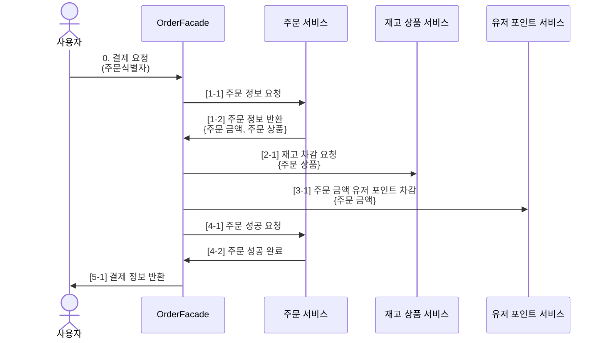

# [8주차] Transaction Diagnosis

> 서비스의 확장에 따라 어플리케이션 서버와 DB를 도메인별로 분리했을때, 트랜잭션 처리의 한계와 대응 방안

- 목차
  - 현재 프로젝트의 우려사항
  - 해결 방안 설계
  - 해결 방안 문제점
  - 해결 방안 구현
  - 추후 확장 방안
---

## 현재 프로젝트의 우려사항

### 1. 트랜잭션 문제
- 현재 프로젝트(e-commerce)내, 주문 도메인에서 다른 도메인의 여러 트랜잭션을 통한 결제 진행 중.

> 위와 같은 구조에서 `트랜잭션` 관리는 모두 OrderFacade 에서 담당을 하며, 각 도메인에 요청하는 주문 결제 과정 중 예외 발생시 롤백을 호출부에서 담당하여, 큰 트랜잭션 흐름을 가져가고 있습니다.
- 발생 가능한 예외
  - `OutOfStockException` : 상품 재고 부족 
  - `InsufficientBalanceException` : 유저 포인트 잔고 부족
  - `AlreadyProcessedPointException` : 이미 차감된 포인트
  - `AlreadyProcessedOrderException` : 이미 처리된 주문
  
- 현재 구조 
  - 각각의 트랜잭션을 분리하지 않음.
  - 호출부(OrderFacade)에서 전체 트랜잭션을 관장하는 구조
  - 서비스의 확장에 따라 한 비즈니스 로직에 매우 큰 트랜잭션의 범위 및 부담 발생 우려
      
- 그로 인한 문제 
  - 분산 서비스 환경에서 각각의 도메인 리소스에 락이 필요한 경우
  - 트랜잭션이 진행되는 동안 해당 리소스의 락을 지속적으로 가짐.
  - 각 서비스간의 지연율을 일으킬 가능성 존재
 

### 2. 한 트랜잭션 내, 다중 락 관리
- 큰 트랜잭션의 흐름에서 여러 리소스에 대한 락을 한 번에 관리 하게 된다면, 서비스 내에 다른 로직에서 특정 도메인에 대한 자원의 별도 락이 필요한 경우, 관계가 없는 리소스에 의한 락 대기 현상을 유발합니다.
- ex
  - 주문이 이뤄지는 동안, 재고 정보가 업데이트 된다면?
  - 어떤 한 유저가 특정 상품에 대해서 주문 중일 때, 다른 유저는 해당 상품을 환불 한다면?
> 위와 같은 상황 처럼, 서로 연관 없는 비즈니스 로직이 각각의 동작을 수행하기 위해서는 겹치는 리소스 락 획득 시도 시 트랜잭션과 락을 적절히 분리함으로써, 다중 락/분산 트랜잭션을 지향해야합니다.

분산락으로 찢는이유, 그로 인해 분산락을 사용하는 이유가 명확해지고
서로 간의 간섭이 줄어듬... 적기~~~~~

---

