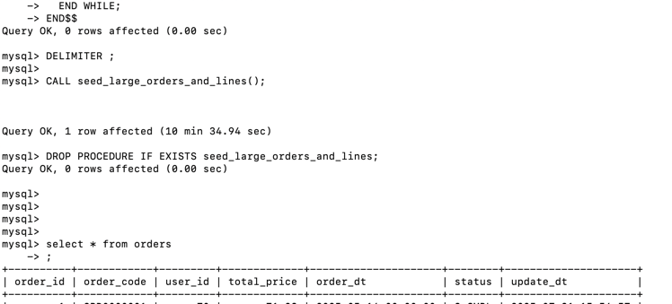
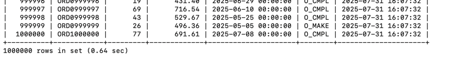
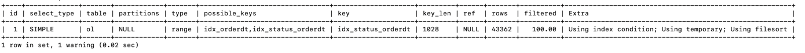

## 판매율 상위 상품 조회 조건에 대한 인덱스 설정해보기 
(+추후 고도화 예정)...

### 1. 집계 쿼리를 기반으로 한 상위 상품
> 최근 3일간, 판매율 높은 상품, 상위 5개

- JPA 코드
```sql
 @Repository
public interface OrderLineJpaRepository extends JpaRepository<OrderLineJpaEntity, Long> {

    // 인덱스 테스트를 위한 함수
    @Query(value = """
        SELECT
          ol.product_line_id   AS productLineId,
          SUM(ol.quantity)     AS totalQuantity
        FROM order_lines ol
        WHERE ol.order_dt BETWEEN :start AND :end
          AND ol.status = 'O_CMPL'
        GROUP BY ol.product_line_id
        ORDER BY totalQuantity DESC
        LIMIT 5
        """,
            nativeQuery = true)
    List<BestSellingProductLineProjection> findTop5ByOrderDtBetween(
            @Param("start") LocalDateTime start,
            @Param("end")   LocalDateTime end
    );
}

```
- 실제 요청되는 쿼리
```sql
SELECT
        ol.product_line_id   AS productLineId,
        SUM(ol.quantity)     AS totalQuantity 
    FROM
        order_lines ol 
    WHERE
        ol.order_dt BETWEEN ? AND ?   
        AND ol.status = 'O_CMPL' 
    GROUP BY
        ol.product_line_id 
    ORDER BY
        totalQuantity DESC 
    LIMIT
        5 

```
---

### 2. 주문 내역 2만 건 정도의 더미 데이터 생성해보기
> 생략 해주셔도됩니다.
```sql
-- src/test/resources/sql/bulk_seed.sql

USE hhplus;
SET FOREIGN_KEY_CHECKS = 0;

--(이미 존재할 수 있는 프로시저/테이블 모두 삭제)
DROP PROCEDURE IF EXISTS seed_users;
DROP PROCEDURE IF EXISTS seed_product_line;
DROP PROCEDURE IF EXISTS seed_orders;
DROP PROCEDURE IF EXISTS seed_order_lines;

TRUNCATE TABLE order_lines;
TRUNCATE TABLE orders;
TRUNCATE TABLE product_line;
TRUNCATE TABLE users;

SET FOREIGN_KEY_CHECKS = 1;
--------------------------------------------------------------------------------
-- 1) users 100명 생성
DELIMITER $$
CREATE PROCEDURE seed_users()
BEGIN
  DECLARE i INT DEFAULT 1;
  WHILE i <= 100 DO
    INSERT INTO users(username)
      VALUES (CONCAT('user', LPAD(i, 3, '0')));
    SET i = i + 1;
  END WHILE;
END$$
DELIMITER ;

CALL seed_users();
DROP PROCEDURE seed_users;
--------------------------------------------------------------------------------
-- 2) product_line 2000개 생성
DELIMITER $$
CREATE PROCEDURE seed_product_line()
BEGIN
  DECLARE i INT DEFAULT 1;
  DECLARE pid INT;
  DECLARE typ VARCHAR(10);
  DECLARE price DECIMAL(12,2);
  DECLARE rem BIGINT;
  WHILE i <= 2000 DO
    SET pid   = ((i - 1) % 100) + 1;                -- product_id 를 1~100 순환
    SET typ   = CONCAT('TYPE', ((i - 1) % 5) + 1);   -- T1~T5 순환
    SET price = ROUND(10 + i * 0.01, 2);            -- 예: 10.01, 10.02...
    SET rem   = FLOOR(RAND() * 100);                -- 0~99 재고
    INSERT INTO product_line
      (product_id, product_line_name, product_line_price, product_line_type, remaining)
    VALUES
      (pid, CONCAT('PL', LPAD(i,4,'0')), price, typ, rem);
    SET i = i + 1;
  END WHILE;
END$$
DELIMITER ;

CALL seed_product_line();
DROP PROCEDURE seed_product_line;
--------------------------------------------------------------------------------
-- 3) orders 105000개 생성 (70k O_CMPL, 20k O_MAKE, 15k O_FAIL)
DELIMITER $$
CREATE PROCEDURE seed_orders()
BEGIN
  DECLARE i INT DEFAULT 1;
  DECLARE uid INT;
  DECLARE stat VARCHAR(10);
  DECLARE tprice DECIMAL(12,2);
  WHILE i <= 105000 DO
    SET uid = ((i - 1) % 100) + 1;
    IF i <= 70000 THEN
      SET stat = 'O_CMPL';
    ELSEIF i <= 90000 THEN
      SET stat = 'O_MAKE';
    ELSE
      SET stat = 'O_FAIL';
    END IF;
    SET tprice = ROUND(RAND() * 1000, 2);
    INSERT INTO orders
      (order_code, user_id, total_price, status)
    VALUES
      (CONCAT('ORD', LPAD(i,6,'0')), uid, tprice, stat);
    SET i = i + 1;
  END WHILE;
END$$
DELIMITER ;

CALL seed_orders();
DROP PROCEDURE seed_orders;
--------------------------------------------------------------------------------
-- 4) order_lines 20000개 생성 (orders 에 골고루 매핑)
DELIMITER $$
CREATE PROCEDURE seed_order_lines()
BEGIN
  DECLARE i INT DEFAULT 1;
  DECLARE oid INT;
  DECLARE plid INT;
  DECLARE qty INT;
  DECLARE price DECIMAL(12,2);
  DECLARE uid INT;
  WHILE i <= 20000 DO
    SET oid   = ((i - 1) % 105000) + 1;  -- 1~105000 순환
    SET plid  = ((i - 1) % 2000) + 1;    -- 1~2000 순환
    SET uid   = ((i - 1) % 100) + 1;     -- 사용자도 1~100 순환
    SET qty   = FLOOR(RAND() * 5) + 1;   -- 1~5개
    SET price = ROUND(RAND() * 200, 2);  -- 0~200 사이 랜덤 가격
    INSERT INTO order_lines
      (order_id, user_id, product_line_id, order_line_price, quantity, status)
    VALUES
      (oid, uid, plid, price, qty, 'O_CMPL');
    SET i = i + 1;
  END WHILE;
END$$
DELIMITER ;

CALL seed_order_lines();
DROP PROCEDURE seed_order_lines;

```

---
### 3. 실제 쿼리를 기반으로 한 실행계획 확인

```sql

SELECT
  ol.product_line_id    AS productLineId,
SUM(ol.quantity)      AS totalQuantity
FROM order_lines AS ol
WHERE ol.order_dt BETWEEN '2025-07-29 00:00:00' AND '2025-07-31 23:59:59'
AND ol.status = 'O_CMPL'
GROUP BY ol.product_line_id
ORDER BY totalQuantity DESC
LIMIT 5;
```

```sql
mysql> explain 
    -> SELECT
    ->   ol.product_line_id    AS productLineId,
    -> SUM(ol.quantity)      AS totalQuantity
    -> FROM order_lines AS ol
    -> WHERE ol.order_dt BETWEEN '2025-07-29 00:00:00' AND '2025-07-31 23:59:59'
    -> AND ol.status = 'O_CMPL'
    -> GROUP BY ol.product_line_id
    -> ORDER BY totalQuantity DESC
    -> LIMIT 5;
+----+-------------+-------+------------+------+---------------+------+---------+------+-------+----------+----------------------------------------------+
| id | select_type | table | partitions | type | possible_keys | key  | key_len | ref  | rows  | filtered | Extra                                        |
+----+-------------+-------+------------+------+---------------+------+---------+------+-------+----------+----------------------------------------------+
|  1 | SIMPLE      | ol    | NULL       | ALL  | NULL          | NULL | NULL    | NULL | 19607 |     1.11 | Using where; Using temporary; Using filesort |
+----+-------------+-------+------------+------+---------------+------+---------+------+-------+----------+----------------------------------------------+
1 row in set, 1 warning (0.03 sec)
```

- 현재 아무 인덱스가 없으므로, 
- type = ALL을 볼 수 있듯이, 
- 테이블 Full scan 을 하며, 약 2만건 중 19607 의 행을 읽을 준비를 하고 있는 것을 볼 수 있습니다.

---

### 4. 인덱스 계획 세워보기

> 전제 조건 
> 복합 인덱스에서 범위 조건을 사용하고 나면, 뒤에오는 where 조건문은 인덱스를 타지 않습니다.
> 
> (범위조건을 통해서 인덱스를 연속적으로 사용할경우, FUll scan 보다 성능이 떨어질 우려가 있기 때문)

그러므로  의도했던 "지난 3일동안", "주문이 완료된", "가장 많은 상품"과 반대로
 `index(status, order_dt)`가 되어버립니다.

- 상품의 상태 status의 경우 "O_MAKE" , "O_CMPL", "O_FAIL" 3가지로 현재 설정하였는데, 
- 이 경우 3개의 DISTINCT 밖에 없으므로 인덱스를 사용하면 효율이 매우 떨어질 것입니다.
- 왜냐하면,
  - ex1) 주문 취소나, 주문 대기 상태가 거의 없고 주문 완료 상품이 대부분이라면??
  - 테이블 풀스캔과 별반 성능 차이가 없을 것이기 때문에,,,
  - `order_dt를 기반으로 한 distinct의 범위가 더 큰 칼럼을 기준으로 인덱스를 잡는것이 더 좋을것입니다.`

이에 따른 두 인덱스를 한번 세워보고 어떤것이 더 실행계획에 효율적으로 나타나는 지 한번 확인해보겟습니다

```sql
-- 1) status→order_dt 인덱스 추가 후 EXPLAIN
ALTER TABLE order_lines
  ADD INDEX idx_status_orderdt (status, order_dt);

EXPLAIN
SELECT
  ol.product_line_id    AS productLineId,
  SUM(ol.quantity)      AS totalQuantity
FROM order_lines AS ol
WHERE ol.order_dt BETWEEN '2025-07-29 00:00:00' AND '2025-07-31 23:59:59'
  AND ol.status = 'O_CMPL'
GROUP BY ol.product_line_id
ORDER BY totalQuantity DESC
LIMIT 5

-- 2) 방금 추가한 인덱스 제거
--ALTER TABLE order_lines
--    DROP INDEX idx_status_orderdt;

```
```sql
+----+-------------+-------+------------+------+--------------------+------+---------+------+-------+----------+----------------------------------------------+
| id | select_type | table | partitions | type | possible_keys      | key  | key_len | ref  | rows  | filtered | Extra                                        |
+----+-------------+-------+------------+------+--------------------+------+---------+------+-------+----------+----------------------------------------------+
|  1 | SIMPLE      | ol    | NULL       | ALL  | idx_status_orderdt | NULL | NULL    | NULL | 19607 |    50.00 | Using where; Using temporary; Using filesort |
+----+-------------+-------+------------+------+--------------------+------+---------+------+-------+----------+----------------------------------------------+
1 row in set, 1 warning (0.00 sec)

```

```sql
-- 3) order_dt 단일 인덱스 추가 후 EXPLAIN
ALTER TABLE order_lines
  ADD INDEX idx_orderdt (order_dt);

EXPLAIN
SELECT
  ol.product_line_id    AS productLineId,
  SUM(ol.quantity)      AS totalQuantity
FROM order_lines AS ol
WHERE ol.order_dt BETWEEN '2025-07-29 00:00:00' AND '2025-07-31 23:59:59'
  AND ol.status = 'O_CMPL'
GROUP BY ol.product_line_id
ORDER BY totalQuantity DESC
LIMIT 5;

-- 4) 방금 추가한 인덱스 제거
--ALTER TABLE order_lines
--  DROP INDEX idx_orderdt;
```
```sql
+----+-------------+-------+------------+------+---------------+------+---------+------+-------+----------+----------------------------------------------+
| id | select_type | table | partitions | type | possible_keys | key  | key_len | ref  | rows  | filtered | Extra                                        |
+----+-------------+-------+------------+------+---------------+------+---------+------+-------+----------+----------------------------------------------+
|  1 | SIMPLE      | ol    | NULL       | ALL  | idx_orderdt   | NULL | NULL    | NULL | 19607 |     5.00 | Using where; Using temporary; Using filesort |
+----+-------------+-------+------------+------+---------------+------+---------+------+-------+----------+----------------------------------------------+
1 row in set, 1 warning (0.00 sec)
```

위 두 지표는 데이터 건수가 작고, order_dt의 값이 모두 7월 31일로 들어가 있어. 인덱스가 제 역할을 하지 못하고 기존의 인덱스가 없던 상황에서, table full scan 하는 것과 동일한 결과를 나타내는 것을 볼 수 있습니다.


---


### 5. 데이터 100만건 더 추가해보기

```sql
-- src/test/resources/sql/seed_large_orders_and_lines.sql

USE hhplus;
SET FOREIGN_KEY_CHECKS = 0;
TRUNCATE TABLE order_lines;
TRUNCATE TABLE orders;
SET FOREIGN_KEY_CHECKS = 1;

DELIMITER $$
CREATE PROCEDURE seed_large_orders_and_lines()
BEGIN
  DECLARE i INT DEFAULT 1;
  DECLARE uid INT;
  DECLARE stat VARCHAR(6);
  DECLARE tprice DECIMAL(12,2);
  DECLARE dt DATETIME;
  DECLARE plid INT;
  DECLARE qty INT;
  DECLARE price DECIMAL(12,2);
  DECLARE r DOUBLE;
  DECLARE days INT;
  -- 2025-05-01 부터 2025-07-31 까지: 92일 간격
  SET days = DATEDIFF('2025-07-31','2025-05-01');

  WHILE i <= 1000000 DO
    -- 1) 주문 생성
    SET uid    = FLOOR(RAND()*100) + 1;             -- user_id 1~100 균등
    SET tprice = ROUND(RAND()*1000,2);              -- total_price 랜덤
    SET r      = RAND();
    IF r < 0.667 THEN
      SET stat = 'O_CMPL';
    ELSEIF r < 0.857 THEN
      SET stat = 'O_MAKE';
    ELSE
      SET stat = 'O_FAIL';
    END IF;
    SET dt = DATE_ADD('2025-05-01', INTERVAL FLOOR(RAND()*(days+1)) DAY);

    INSERT INTO orders(order_code, user_id, total_price, order_dt, status)
    VALUES (
      CONCAT('ORD', LPAD(i,7,'0')),
      uid,
      tprice,
      dt,
      stat
    );

    -- 2) 주문 라인 생성 (1:1 매핑)
    SET plid  = FLOOR(RAND()*2000) + 1;              -- product_line_id 1~2000 균등
    SET qty   = FLOOR(RAND()*5) + 1;                 -- quantity 1~5
    SET price = ROUND(RAND()*200,2);                 -- order_line_price 랜덤

    INSERT INTO order_lines
      (order_id, user_id, product_line_id, order_line_price, quantity, status, order_dt)
    VALUES (
      i,    -- order_id
      uid,
      plid,
      price,
      qty,
      stat,
      dt
    );

    SET i = i + 1;
  END WHILE;
END$$
DELIMITER ;

CALL seed_large_orders_and_lines();
DROP PROCEDURE IF EXISTS seed_large_orders_and_lines;

```




---

### 6. 100만건에서 다시 인덱스 적용해보기

```sql
EXPLAIN
SELECT
  ol.product_line_id    AS productLineId,
  SUM(ol.quantity)      AS totalQuantity
FROM order_lines AS ol
WHERE ol.order_dt BETWEEN '2025-07-29 00:00:00' AND '2025-07-31 23:59:59'
  AND ol.status = 'O_CMPL'
GROUP BY ol.product_line_id
ORDER BY totalQuantity DESC
LIMIT 5;
```

```sql
+----+-------------+-------+------------+------+---------------+------+---------+------+--------+----------+----------------------------------------------+
| id | select_type | table | partitions | type | possible_keys | key  | key_len | ref  | rows   | filtered | Extra                                        |
+----+-------------+-------+------------+------+---------------+------+---------+------+--------+----------+----------------------------------------------+
|  1 | SIMPLE      | ol    | NULL       | ALL  | NULL          | NULL | NULL    | NULL | 995120 |     1.11 | Using where; Using temporary; Using filesort |
+----+-------------+-------+------------+------+---------------+------+---------+------+--------+----------+----------------------------------------------+
1 row in set, 1 warning (0.01 sec)

```
100만건중 99만5천건을 읽을 예상을 하는 옵티마이저를 볼 수 있습니다.

### 6-1. 다시 한번 인덱스를 적용한다면??

index(status, order_dt)
```sql
+----+-------------+-------+------------+-------+--------------------+--------------------+---------+------+-------+----------+--------------------------------------------------------+
| id | select_type | table | partitions | type  | possible_keys      | key                | key_len | ref  | rows  | filtered | Extra                                                  |
+----+-------------+-------+------------+-------+--------------------+--------------------+---------+------+-------+----------+--------------------------------------------------------+
|  1 | SIMPLE      | ol    | NULL       | range | idx_status_orderdt | idx_status_orderdt | 1028    | NULL | 43362 |   100.00 | Using index condition; Using temporary; Using filesort |
+----+-------------+-------+------------+-------+--------------------+--------------------+---------+------+-------+----------+--------------------------------------------------------+
1 row in set, 1 warning (0.00 sec)
```

index(order_dt)
```sql
+----+-------------+-------+------------+-------+---------------+-------------+---------+------+-------+----------+---------------------------------------------------------------------+
| id | select_type | table | partitions | type  | possible_keys | key         | key_len | ref  | rows  | filtered | Extra                                                               |
+----+-------------+-------+------------+-------+---------------+-------------+---------+------+-------+----------+---------------------------------------------------------------------+
|  1 | SIMPLE      | ol    | NULL       | range | idx_orderdt   | idx_orderdt | 6       | NULL | 62844 |    10.00 | Using index condition; Using where; Using temporary; Using filesort |
+----+-------------+-------+------------+-------+---------------+-------------+---------+------+-------+----------+---------------------------------------------------------------------+
1 row in set, 1 warning (0.01 sec)

```

full 스캔 이었던 type all 에서 type range로 변경된 것을 알 수 있습니다.

- index(status,order_dt) 의 경우 Using index condition; 이후에 후속 필터링이 없었지만,

- index(order_dt)의 경우에는 인덱스를 한 후에 Using where를 통해서 추가 필터링이 발생한 것을 볼 수 있습니다.

> filtered = 100% → 인덱스 조건만으로 모든 필터링이 끝나 추가 필터링이 필요 없었다

> filtered < 100% → 일부 조건은 인덱스 단계에서 처리되지 않아, 후속 필터링(Using where)이 있었다

조건의 범위에서는 distinct(중복되는) 값에 대해서, 반드시 걸어야할 것 같지만, 쿼리의 성능 적인 면으로 보았을때는 status, order_Dt의 방법이 훨씬더 정갈한 방법으로 보입니다.

두인덱스를 모두 걸어도 idx_status_orderdt를 가져오는 것을 확인할 수 있습니다.



### 6-2.  인덱스 크기도 한번 보기
```sql
SELECT
  table_name    AS `Table`,
  ROUND(index_length/1024/1024, 2) AS `Index_MB`
FROM information_schema.TABLES
WHERE table_schema = 'hhplus'
and table_name = 'order_lines';
;

-- index(order_dt), index(status, order_dt) 를 추가/삭제해도 똑같았음.
+-------------+----------+
| Table       | Index_MB |
+-------------+----------+
| order_lines |    21.56 |
+-------------+----------+
1 row in set (0.00 sec)
```

### 6-3. 커버링 인덱스도 추가해보기
```sql
ALTER TABLE order_lines
  ADD INDEX idx_covering (
    order_dt,
    status,
    product_line_id,
    quantity
  );
```

```sql
+----+-------------+-------+------------+-------+---------------------------------------------+--------------+---------+------+-------+----------+-----------------------------------------------------------+
| id | select_type | table | partitions | type  | possible_keys                               | key          | key_len | ref  | rows  | filtered | Extra                                                     |
+----+-------------+-------+------------+-------+---------------------------------------------+--------------+---------+------+-------+----------+-----------------------------------------------------------+
|  1 | SIMPLE      | ol    | NULL       | range | idx_orderdt,idx_covering,idx_status_orderdt | idx_covering | 1028    | NULL | 63110 |    50.00 | Using where; Using index; Using temporary; Using filesort |
+----+-------------+-------+------------+-------+---------------------------------------------+--------------+---------+------+-------+----------+-----------------------------------------------------------+
1 row in set, 1 warning (0.00 sec)
```

### 6-4. 혹시나 조회조건에 따른 변동사항이 있을지, where문 순서 바꿔보기

```sql
mysql> EXPLAIN 
    SELECT ol.product_line_id    AS productLineId,
           SUM(ol.quantity)      AS totalQuantity
    FROM order_lines AS ol
    WHERE ol.status = 'O_CMPL'  -- 조회 조건 순서 변경
      and ol.order_dt BETWEEN '2025-07-29 00:00:00' AND '2025-07-31 23:59:59'
    GROUP BY ol.product_line_id 
    ORDER BY totalQuantity DESC LIMIT 5;
+----+-------------+-------+------------+-------+--------------------------------+--------------------+---------+------+-------+----------+--------------------------------------------------------+
| id | select_type | table | partitions | type  | possible_keys                  | key                | key_len | ref  | rows  | filtered | Extra                                                  |
+----+-------------+-------+------------+-------+--------------------------------+--------------------+---------+------+-------+----------+--------------------------------------------------------+
|  1 | SIMPLE      | ol    | NULL       | range | idx_orderdt,idx_status_orderdt | idx_status_orderdt | 1028    | NULL | 43362 |   100.00 | Using index condition; Using temporary; Using filesort |
+----+-------------+-------+------------+-------+--------------------------------+--------------------+---------+------+-------+----------+--------------------------------------------------------+
1 row in set, 1 warning (0.00 sec)
```

커버링 조건을 통해서, 인덱스를 기반으로 한 내부 칼럼을 더 빠르게 접근할 순 있겠지만,
단순 조회의 성격을 가진 형태를 볼때는 status, order_dt 를 선택하는 것이 더 좋을 수도 있을 것 같습니다.

---

### 7. 그렇다면 DateTime 말고 Date로 인덱스 잡아보기

기존에 테이블 설계에서는 주문 일시를 DateTime으로 작성하였습니다.

- 이를 DateTime으로 대체한다면?? (가정)
  - 시/분/초 에 대한 더 넓은 범위 보다 distinct 되어 3일이라는 날짜 범위를 더 높은 단위의 블럭 크기로 잡고,
인덱스의 효율을 높일 수 있을 것 같습니다..

> order_dt라고 잘못 이름을 지었어서,, (order_at) 이라고 했어야 했는데 order_yymmdd 칼럼을 추가하고 100만건에 대해서 update를 돌린 후에 진행하도록 하겠습니다.

```sql
USE hhplus;

-- 1) 칼럼 추가
 ALTER TABLE order_lines
  ADD COLUMN order_YYMMDD DATE NULL AFTER order_dt;

 UPDATE order_lines
  SET order_YYMMDD = DATE(order_dt);
```


### 7-1. Date 기반의 인덱스 적용해보기.
```sql
CREATE INDEX idx_status_orderyyyy (status, order_YYMMDD);
CREATE INDEX idx_orderyyyy (order_YYMMDD);
```

```sql
mysql> EXPLAIN
    -> SELECT
    ->   ol.product_line_id    AS productLineId,
    ->   SUM(ol.quantity)      AS totalQuantity
    -> FROM order_lines AS ol
    -> WHERE ol.status = 'O_CMPL'
    ->   AND ol.order_YYMMDD BETWEEN '2025-07-29' AND '2025-07-31'
    -> GROUP BY ol.product_line_id
    -> ORDER BY totalQuantity DESC
    -> LIMIT 5;
+----+-------------+-------+------------+-------+---------------+---------------+---------+------+-------+----------+--------------------------------------------------------------------------------+
| id | select_type | table | partitions | type  | possible_keys | key           | key_len | ref  | rows  | filtered | Extra                                                                          |
+----+-------------+-------+------------+-------+---------------+---------------+---------+------+-------+----------+--------------------------------------------------------------------------------+
|  1 | SIMPLE      | ol    | NULL       | range | idx_orderyyyy | idx_orderyyyy | 4       | NULL | 62736 |    10.00 | Using index condition; Using where; Using MRR; Using temporary; Using filesort |
+----+-------------+-------+------------+-------+---------------+---------------+---------+------+-------+----------+--------------------------------------------------------------------------------+
1 row in set, 1 warning (0.01 sec)

```

```sql
mysql> EXPLAIN
 -> SELECT
     ->   ol.product_line_id    AS productLineId,
     ->   SUM(ol.quantity)      AS totalQuantity
     -> FROM order_lines AS ol
     -> WHERE ol.status = 'O_CMPL'
     ->   AND ol.order_YYMMDD BETWEEN '2025-07-29' AND '2025-07-31'
     -> GROUP BY ol.product_line_id
     -> ORDER BY totalQuantity DESC
 -> LIMIT 5;
+----+-------------+-------+------------+-------+----------------------+----------------------+---------+------+-------+----------+-------------------------------------------------------------------+
| id | select_type | table | partitions | type  | possible_keys        | key                  | key_len | ref  | rows  | filtered | Extra                                                             |
+----+-------------+-------+------------+-------+----------------------+----------------------+---------+------+-------+----------+-------------------------------------------------------------------+
|  1 | SIMPLE      | ol    | NULL       | range | idx_status_orderyyyy | idx_status_orderyyyy | 1026    | NULL | 44118 |   100.00 | Using index condition; Using MRR; Using temporary; Using filesort |
+----+-------------+-------+------------+-------+----------------------+----------------------+---------+------+-------+----------+-------------------------------------------------------------------+
```

---
### 8. (Index) Date vs DateTime 

index(status, order_dt)
```sql
+----+-------------+-------+------------+-------+--------------------+--------------------+---------+------+-------+----------+--------------------------------------------------------+
| id | select_type | table | partitions | type  | possible_keys      | key                | key_len | ref  | rows  | filtered | Extra                                                  |
+----+-------------+-------+------------+-------+--------------------+--------------------+---------+------+-------+----------+--------------------------------------------------------+
|  1 | SIMPLE      | ol    | NULL       | range | idx_status_orderdt | idx_status_orderdt | 1028    | NULL | 43362 |   100.00 | Using index condition; Using temporary; Using filesort |
+----+-------------+-------+------------+-------+--------------------+--------------------+---------+------+-------+----------+--------------------------------------------------------+
1 row in set, 1 warning (0.00 sec)
```

index(order_dt)
```sql
+----+-------------+-------+------------+-------+---------------+-------------+---------+------+-------+----------+---------------------------------------------------------------------+
| id | select_type | table | partitions | type  | possible_keys | key         | key_len | ref  | rows  | filtered | Extra                                                               |
+----+-------------+-------+------------+-------+---------------+-------------+---------+------+-------+----------+---------------------------------------------------------------------+
|  1 | SIMPLE      | ol    | NULL       | range | idx_orderdt   | idx_orderdt | 6       | NULL | 62844 |    10.00 | Using index condition; Using where; Using temporary; Using filesort |
+----+-------------+-------+------------+-------+---------------+-------------+---------+------+-------+----------+---------------------------------------------------------------------+
1 row in set, 1 warning (0.01 sec)
```

- index(order_yymmdd)

```sql
+----+-------------+-------+------------+-------+---------------+---------------+---------+------+-------+----------+--------------------------------------------------------------------------------+
| id | select_type | table | partitions | type  | possible_keys | key           | key_len | ref  | rows  | filtered | Extra                                                                          |
+----+-------------+-------+------------+-------+---------------+---------------+---------+------+-------+----------+--------------------------------------------------------------------------------+
|  1 | SIMPLE      | ol    | NULL       | range | idx_orderyyyy | idx_orderyyyy | 4       | NULL | 62736 |    10.00 | Using index condition; Using where; Using MRR; Using temporary; Using filesort |
+----+-------------+-------+------------+-------+---------------+---------------+---------+------+-------+----------+--------------------------------------------------------------------------------+

```

- index(status, order_yymmdd)
```sql
+----+-------------+-------+------------+-------+----------------------+----------------------+---------+------+-------+----------+-------------------------------------------------------------------+
| id | select_type | table | partitions | type  | possible_keys        | key                  | key_len | ref  | rows  | filtered | Extra                                                             |
+----+-------------+-------+------------+-------+----------------------+----------------------+---------+------+-------+----------+-------------------------------------------------------------------+
|  1 | SIMPLE      | ol    | NULL       | range | idx_status_orderyyyy | idx_status_orderyyyy | 1026    | NULL | 44118 |   100.00 | Using index condition; Using MRR; Using temporary; Using filesort |
+----+-------------+-------+------------+-------+----------------------+----------------------+---------+------+-------+----------+-------------------------------------------------------------------+
```

- index(order_yymmdd, status)
```sql
+----+-------------+-------+------------+-------+-----------------------+-----------------------+---------+------+-------+----------+-------------------------------------------------------------------+
| id | select_type | table | partitions | type  | possible_keys         | key                   | key_len | ref  | rows  | filtered | Extra                                                             |
+----+-------------+-------+------------+-------+-----------------------+-----------------------+---------+------+-------+----------+-------------------------------------------------------------------+
|  1 | SIMPLE      | ol    | NULL       | range | idx_status_orderyyyy2 | idx_status_orderyyyy2 | 1026    | NULL | 58110 |    10.00 | Using index condition; Using MRR; Using temporary; Using filesort |
+----+-------------+-------+------------+-------+-----------------------+-----------------------+---------+------+-------+----------+-------------------------------------------------------------------+
```

- index(status, order_yymmdd, product_line_id)
```sql
+----+-------------+-------+------------+-------+---------------------------+---------------------------+---------+------+-------+----------+-------------------------------------------------------------------+
| id | select_type | table | partitions | type  | possible_keys             | key                       | key_len | ref  | rows  | filtered | Extra                                                             |
+----+-------------+-------+------------+-------+---------------------------+---------------------------+---------+------+-------+----------+-------------------------------------------------------------------+
|  1 | SIMPLE      | ol    | NULL       | range | idx_status_orderyyyy_plId | idx_status_orderyyyy_plId | 1026    | NULL | 43696 |   100.00 | Using index condition; Using MRR; Using temporary; Using filesort |
+----+-------------+-------+------------+-------+---------------------------+---------------------------+---------+------+-------+----------+-------------------------------------------------------------------+
```
 
!!! Date를 사용하는 인덱스부터, 기존의 Index condition 뿐만아니라, !!!
> order_yymmdd 부터 MRR (Multi-Range Read)를 통해 더 높은 성능을 띄우는 것을 볼 수 있었습니다.

---

### 9. 결론

#### 선택 인덱스
- index(status, order_yymmdd)
```sql
+----+-------------+-------+------------+-------+----------------------+----------------------+---------+------+-------+----------+-------------------------------------------------------------------+
| id | select_type | table | partitions | type  | possible_keys        | key                  | key_len | ref  | rows  | filtered | Extra                                                             |
+----+-------------+-------+------------+-------+----------------------+----------------------+---------+------+-------+----------+-------------------------------------------------------------------+
|  1 | SIMPLE      | ol    | NULL       | range | idx_status_orderyyyy | idx_status_orderyyyy | 1026    | NULL | 44118 |   100.00 | Using index condition; Using MRR; Using temporary; Using filesort |
+----+-------------+-------+------------+-------+----------------------+----------------------+---------+------+-------+----------+-------------------------------------------------------------------+
```

상품의 종류가 늘거나, 상품 라인의 구매 비율 분포가 굉장히 여러 방면으로 많이 퍼진다면 고려해볼만 하지만
product_line_id를 인덱스를 추가하지 않는 방법도 크게 성능에 100만건 내에서는 차이가 없는 것을 확인할 수 있었습니다.

---

### 10. JPA 수정

- 목표 테이블 형태
```sql
+------------------+---------------+------+-----+-------------------+-----------------------------------------------+
| Field            | Type          | Null | Key | Default           | Extra                                         |
+------------------+---------------+------+-----+-------------------+-----------------------------------------------+
| order_line_id    | bigint        | NO   | PRI | NULL              | auto_increment                                |
| order_id         | bigint        | YES  | MUL | NULL              |                                               |
| user_id          | bigint        | NO   |     | NULL              |                                               |
| product_line_id  | bigint        | NO   |     | NULL              |                                               |
| order_line_price | decimal(12,2) | YES  |     | NULL              |                                               |
| quantity         | int           | YES  |     | NULL              |                                               |
| coupon_yn        | varchar(1)    | NO   |     | N                 |                                               |
| coupon_code      | varchar(255)  | YES  |     | NULL              |                                               |
| dis_count_price  | decimal(12,2) | YES  |     | NULL              |                                               |
| status           | varchar(255)  | NO   | MUL | NULL              |                                               |
| order_dt         | datetime      | YES  |     | CURRENT_TIMESTAMP | DEFAULT_GENERATED                             |
| order_YYMMDD     | date          | YES  |     | NULL              |                                               |
| update_dt        | datetime      | NO   |     | CURRENT_TIMESTAMP | DEFAULT_GENERATED on update CURRENT_TIMESTAMP |
```

- jpa 엔티티 수정
1. status 길이 10으로 제한하기
2. 칼럼 DateTime 인 orderYYMMDD 추가하기
3. index(status, orderyymmdd) 추가하기 

```sql
@Entity
@Table(
    name = "order_lines", 
    /** 수정 위치 */
    indexes = {
        @Index(
            name = "idx_status_orderyyyy", 
            columnList = "status, order_YYMMDD"
        )
    }
)
@Getter
@NoArgsConstructor
public class OrderLineJpaEntity {
    @Id
    @GeneratedValue(strategy = GenerationType.IDENTITY)
    private Long orderLineId;

    @ManyToOne(fetch = FetchType.LAZY)
    @JoinColumn(name = "order_id")
    private OrderJpaEntity order;

    @Column(nullable = false)
    private Long userId;

    @Column(nullable = false)
    private Long productLineId;

    @Column(precision = 12, scale = 2)
    private BigDecimal orderLinePrice;

    private int quantity;

    @Column(length = 1, nullable = false, columnDefinition = "VARCHAR(1) DEFAULT 'N'")
    private String couponYn = "N";

    private String couponCode;

    @Column(precision = 12, scale = 2)
    private BigDecimal disCountPrice;

    /** 수정 위치 */
    @Column(length = 1, nullable = false)
    private String status;

    /** 수정 위치 */
    @Column(
        nullable = false,
        columnDefinition = "DATETIME DEFAULT CURRENT_TIMESTAMP"
    )
    private LocalDateTime orderDt;

    @Column(name = "order_YYMMDD", nullable = false)
    private LocalDate orderYYMMDD;

    @UpdateTimestamp
    @Column(
        name = "update_dt",
        nullable = false,
        columnDefinition = "DATETIME NOT NULL DEFAULT CURRENT_TIMESTAMP ON UPDATE CURRENT_TIMESTAMP"
    )
    private LocalDateTime updateDt;
}

```