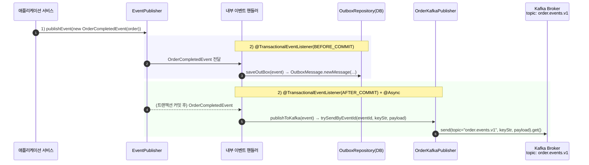
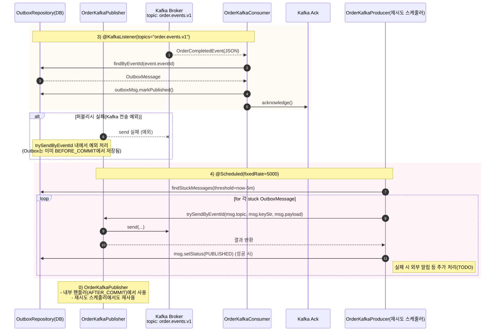
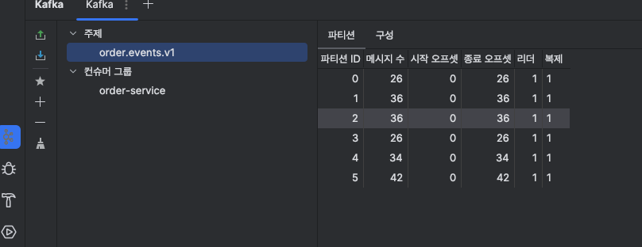
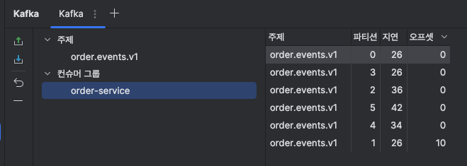

## 실시간 주문 정보 전송 카프카로 진행해보기

- 카프카를 이용하여 주문 결제 정보 트랜잭션 완료 후, 외부로 정보를 보내는 방식을 
- Application + Kafka Event로 작성 해보았습니다.
- 현재는 컨슈머에 Outbox상태를 완료하는 후속 동작만 작성하였지만,, 이후에 사가패턴으로 분리하여 이벤트 기반의 비동기적 흐름을 만들어보는 것을 목표로 하고자 합니다..
### 1. Application Event Sequence


### 2. Kafka Event Sequence

---
### 토픽 설정

```java
@Configuration
public class OrderTopicConfig {

    @Bean
    NewTopic orderEvents(){
        return TopicBuilder.name("order.events.v1")
                .partitions(3).replicas(1)
                .config("cleanup.policy", "delete")
                .config("retention.ms", "300000") // 5분
                .build();
    }
}
```
- 코드 레벨에서 Topic을 정의합니다.
- 운영에서는 IaC를 통해서, 사전에 토픽들을 인프라 레벨에서 관리한다고 하였지만, 웹앱에서 코드레벨로 한번 더 보장해주기.
---
### 프로퍼티 기반의 컨슈머 설정
```yaml
  kafka:
    consumer:
      group-id: order-service   # 결제 결과를 받는 컨슈머
      enable-auto-commit: false
      auto-offset-reset: latest
      key-deserializer: org.apache.kafka.common.serialization.StringDeserializer
      value-deserializer: org.springframework.kafka.support.serializer.JsonDeserializer
      properties:
        spring.json.trusted.packages: "*"
        spring.json.value.default.type: "kr.hhplus.be.server.domain.order.adapter.event.OrderCompletedEvent"
```
- 파티션을 처리할 컨슈머들의 Group 설정하기.
- 카프카 내부에 데이터(메타데이터)를 전달할 때는 String으로 직렬화/역직렬화를 하기 위해 위와 같은 설정을 하였습니다.

---
### Kafka 퍼블리셔
```java
@Component
@RequiredArgsConstructor
public class OrderKafkaPublisher {
    private final KafkaTemplate<String, Object> kafka;
    private static final String topic = "order.events.v1";
    public void trySendByEventId(String eventId, String keyStr, Object payload){
        try{
            kafka.send(topic, keyStr, payload).get();
        }catch(Exception e){
            // failed
        }
    }
}
```
-- `kafka.send(토픽, 키, 메타데이터)` 발행

---

### Kafka 컨슈머
```java
@Slf4j
@Component
@RequiredArgsConstructor
public class OrderKafkaConsumer {
    private final ObjectMapper om;
    private final OutboxJpaRepository outboxRepository;

    @KafkaListener(topics = "order.events.v1", groupId = "order-service")
    @Transactional
    public void onOrderComplete(JsonNode o, Acknowledgment ack){
        try{
            OrderCompletedEvent event = om.treeToValue(o, OrderCompletedEvent.class);

            OutboxMessage outboxMsg =  outboxRepository.findByEventId(event.eventId())
                    .orElseThrow();

            outboxMsg.markPublished();

            ack.acknowledge();
        }catch(Exception e){

        }
    }
}
```
- `@KafkaListener`를 통해, 이벤트 수신 시, Outbox 상태 업데이트 및 (+후속 동작)

---
### Outbox 메세지
```java
@Getter
@Setter
public class OutboxMessage {
    @Id
    @GeneratedValue(strategy=IDENTITY) Long id;
    String eventId;
    String topic;
    String keyStr;
    @Column(columnDefinition = "json") String payload; // 또는 @JdbcType(JsonType.class)

    @Enumerated(EnumType.STRING) Status status = Status.NEW;
    int retryCount;
    Instant nextAttemptAt;
    String lastError;
    Instant createdAt;
    Instant updatedAt;

    public static OutboxMessage newMessage(String eventId, String topic, String key, JsonNode payload) {
        var m = new OutboxMessage();
        m.eventId = eventId;
        m.topic = topic;
        m.keyStr = key;
        m.payload = payload.toString();
        m.status = Status.NEW;
        return m;
    }

    public void markPublished() {
        this.status = Status.PUBLISHED;
        this.lastError = null;
        this.nextAttemptAt = null;
    }

    public void markFailedWithBackoff(String error) {
        this.status = Status.NEW; // 여전히 NEW (재시도 대기)
        this.retryCount++;
        this.lastError = (error != null && error.length() > 1000) ? error.substring(0,1000) : error;
        long delayMs = Math.min(60_000, (long)Math.pow(2, Math.min(retryCount, 8)) * 200L); // 0.2s→...→~60s
        this.nextAttemptAt = Instant.now().plusMillis(delayMs);
    }

    public enum Status { NEW, PUBLISHED, FAILED }
}
```

---

### 카프카 발행 내역 확인

> 테스트 코드를 통해, 함수를 호출하고 지정된 키에 대한 파티션과 컨슈머가 외부에서 동작하는 모습을 볼 수 있었습니다..
> - 테스트 고도화 필요,,




---