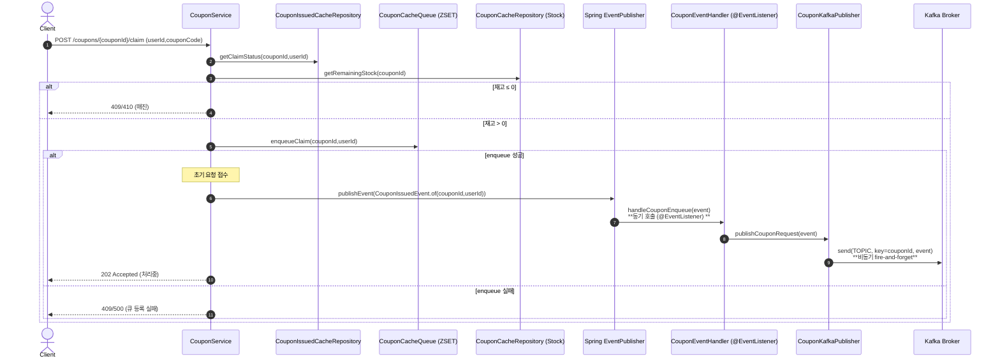
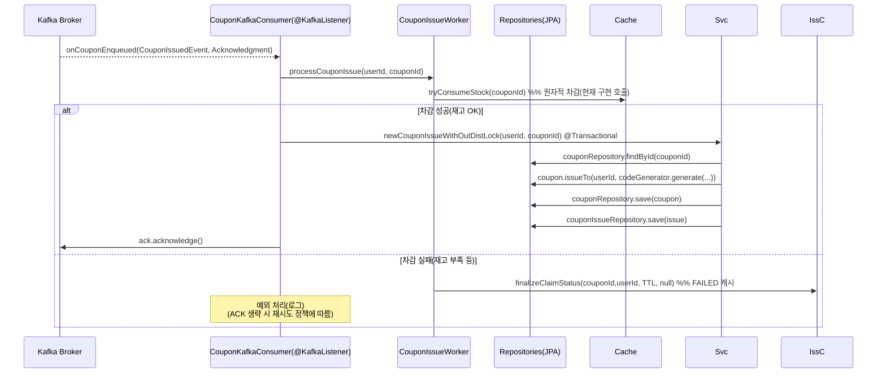
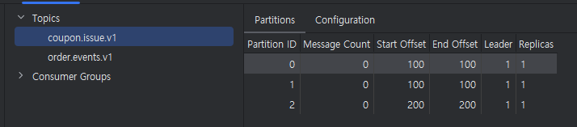
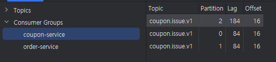

## 기존의 쿠폰 발행 방식 + Kafka

- 기존 쿠폰 발행방식에, 초기 요청 시 애플리케이션 이벤트를 방행하여 카프카 퍼블리싱 단계를 추가해보았습니다.
- 다만, 기존에는 ZSET 기반의 (시간순 정렬) 통해 Pop을 하였지만,, 이 부분에 대한 큐를 카프카의 파티션으로 진행할 예정,,

### Application Sequence 


### Kafka Sequence


---

## 코드 구현

### CouponService
```java
void 쿠폰_발행_클레임(){
    // condition : 초기 발행 일 경우, 레디스에 상태 갱신 후 이벤트 발행
    eventPublisher.publishEvent(CouponIssuedEvent.of(
            couponId,
            userId
    ));
}
```

### CouponEventHandler
```java
@Component
@RequiredArgsConstructor
public class CouponEventHandler {

    private final CouponKafkaPublisher kafkaPublisher;

    @EventListener
    public void handleCouponEnqueue(CouponIssuedEvent event){
        kafkaPublisher.publishCouponRequest(event);
    }
}

public record CouponIssuedEvent(
        String eventId,
        Long couponId,
        Long userId,
        Instant requestedAt
) {
    public static CouponIssuedEvent of(Long couponId, Long userId) {
        return new CouponIssuedEvent(
                UUID.randomUUID().toString(),
                couponId,
                userId,
                Instant.now()
        );
    }
}
```

### CouponKafkaPublisher
```java
@Component
@RequiredArgsConstructor
public class CouponKafkaPublisher {
    private final KafkaTemplate<String, CouponIssuedEvent> kafka;
    private static final String TOPIC = "coupon.issue.v1";

    public void publishCouponRequest(CouponIssuedEvent event) {
        try{
            kafka.send(TOPIC, event.couponId().toString(), event);
        }catch(Exception e){
            //failed
        }
    }
}
```
---
### CouponKafkaConsumer
```java
@Slf4j
@Component
@RequiredArgsConstructor
public class CouponKafkaConsumer {
    private final ObjectMapper om;
    private final CouponIssueWorker couponIssueWorker;

    private final CouponService service;

    @KafkaListener(
            topics = "coupon.issue.v1",
            groupId = "coupon-service" ,
            containerFactory = "couponKafkaListenerFactory"
    )
    @Transactional
    public void onCouponEnqueued(CouponIssuedEvent event, Acknowledgment ack){
        try{
            // 레디스 컨슈밍 및 캐시
            couponIssueWorker.processCouponIssue(event.userId(), event.couponId());

            // 쿠폰 저장
            service.newCouponIssueWithOutDistLock(event.userId(), event.couponId());

            ack.acknowledge();
        }catch(Exception e){
            //System.out.println("컨슈머 에러: " + e);
        }
    }
}
```
- 컨슈머를 통해, 레디스 캐싱 데이터 설정 및 쿠폰 저장 호출
- ---

### CouponService
```java
@Transactional
    public CouponIssue newCouponIssueWithOutDistLock(Long userId, Long couponId) {
        Coupon coupon = //couponRepository.findByIdWithPessimisticLock(couponId)
                couponRepository.findById(couponId)
                        .orElseThrow(() -> new NoSuchElementException("존재하지 않는 쿠폰입니다. newCouponIssueWithOutDistLock"));

        String code = codeGenerator.generate(coupon, coupon.getCouponId(), coupon.getRemaining());
        CouponIssue issue = coupon.issueTo(userId, code);

        // 변경된 coupon, 발급된 issue 둘 다 저장
        couponRepository.save(coupon);
        return couponIssueRepository.save(issue);
    }
```
- 쿠폰 정보 수정 후 저장
---
### CouponIssueWorker
```java
public void processCouponIssue(Long userId, Long couponId){
        // Redis에서 원자적 차감
        Long stock = couponCacheRepository.tryConsumeStock(couponId);
        if (stock < 0L) {
            // 잔여 수량 없음 → 실패 처리
            issuedCacheRepository.finalizeClaimStatus(
                    couponId, userId, Duration.ofMinutes(5), null
            );
            log.warn("쿠폰 [{}] - 사용자 [{}] 발급 실패 (재고 부족)", couponId, userId);
            return;
        }
    }
```

- 카프카 우선 활용을 위해, 기존 워커 재활용..
  - 원자적 차감과, 쿠폰 이슈 클레임 상태 변경만 넣은 상태..

---

### 수행 시도 결과

카프카에 대한 내용을 더욱 심화있게 학습하지 못하고 진행하였더니,,, 나온 결과는 실패였습니다..
> - 아래와 같이 Topic에 존재하는 옵셋은 테스트 코드에 작성한 수량만큼 모두 EndOffset으로 나타나는데,
> - Consumer에서는 Offset이 진행되다가 초반 일부만 Commit되고, 나머지는 읽지 못한 것처럼 결과가 나옵니다...




- 좀 더 많은 시간을 통해,,, 개선하고 디버깅 해봐야할 내용 같아 부끄럽습니다..
- 초반 설계에서는 될 것으로 예상했으나,,, 실제 시도시에는 아직까지 원인을 찾지 못하였습니다..
