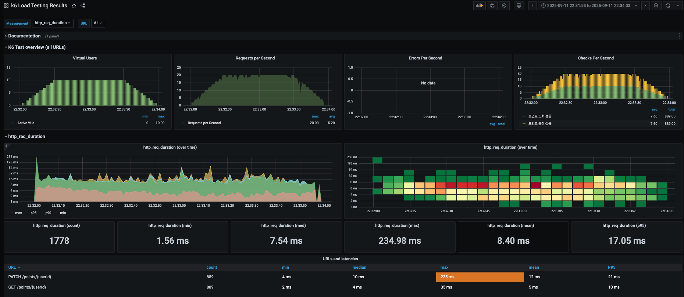
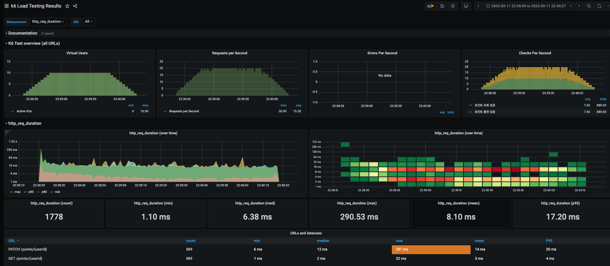

### 비관적 락
- 요청 889 번에 대한 10포인트씩 충전 모두 성공!!!
```
 GET /localhost:8081/points/1
 Response
 {
 "code": "SUCCESS",
 "message": "OK",
     "data": {
         "userId": 1,
         "balance": 8890
     }
 }
 HTTP
 http_req_duration..............: avg=8.4ms min=1.55ms med=7.54ms max=234.98ms p(90)=13.91ms p(95)=17.06ms
 { expected_response:true }...: avg=8.4ms min=1.55ms med=7.54ms max=234.98ms p(90)=13.91ms p(95)=17.06ms
 http_req_failed................: 0.00%  0 out of 1778
 http_reqs......................: 1778   14.764293/s
   
 EXECUTION
 iteration_duration.............: avg=1.01s min=1s     med=1.01s  max=1.26s    p(90)=1.02s   p(95)=1.03s  
 iterations.....................: 889    7.382146/s
 vus............................: 1      min=0         max=10
 vus_max........................: 10     min=10        max=10
   
 NETWORK
 data_received..................: 349 kB 2.9 kB/s
 data_sent......................: 265 kB 2.2 kB/s
``` 



---
### 분산 락
- 요청 889 번에 대한 10포인트씩 충전 모두 성공!!!
```
 GET /localhost:8081/points/1
   
 Response
 {
 "code": "SUCCESS",
 "message": "OK",
 "data": {
   "userId": 1,
   "balance": 8890
 }
 }
   
 HTTP
 http_req_duration..............: avg=8.09ms min=1.09ms med=6.37ms max=290.52ms p(90)=14.86ms p(95)=17.2ms
   { expected_response:true }...: avg=8.09ms min=1.09ms med=6.37ms max=290.52ms p(90)=14.86ms p(95)=17.2ms
 http_req_failed................: 0.00%  0 out of 1778
 http_reqs......................: 1778   14.748776/s
   
 EXECUTION
 iteration_duration.............: avg=1.01s  min=1s     med=1.01s  max=1.31s    p(90)=1.02s   p(95)=1.02s 
 iterations.....................: 889    7.374388/s
 vus............................: 1      min=0         max=10
 vus_max........................: 10     min=10        max=10
   
 NETWORK
 data_received..................: 349 kB 2.9 kB/s
 data_sent......................: 265 kB 2.2 kB/s
```



| 지표                          | Redis 분산락 | DB 비관적락  | 해석                                |
| --------------------------- | --------- | -------- | --------------------------------- |
| **http\_req\_duration 평균**  | 8.09ms    | 8.40ms   | Redis가 약 0.3ms 더 빠름 (큰 차이 아님)     |
| **http\_req\_duration 중앙값** | 6.37ms    | 7.54ms   | Redis가 중앙값에서 더 낮음                 |
| **최대 응답시간**                 | 290.52ms  | 234.98ms | DB 락이 최대값에서 안정적 (Redis는 일부 요청이 튐) |
| **90% 응답시간 (p90)**          | 14.86ms   | 13.91ms  | DB 락이 tail latency 더 안정적          |
| **95% 응답시간 (p95)**          | 17.20ms   | 17.06ms  | 거의 동일                             |
| **http\_req\_failed**       | 0%        | 0%       | 둘 다 실패 없음                         |
| **iteration\_duration 평균**  | 1.01s     | 1.01s    | 차이 없음                             |
| **최대 iteration\_duration**  | 1.31s     | 1.26s    | DB 락이 약간 더 안정적                    |
