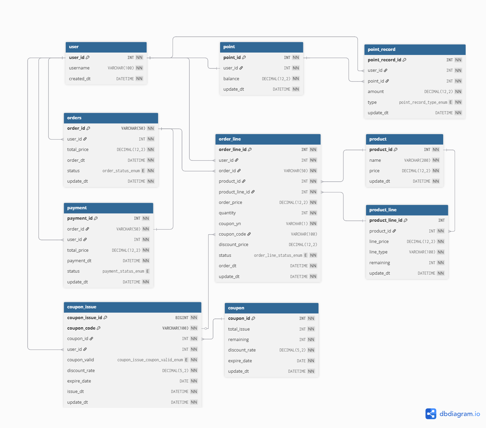
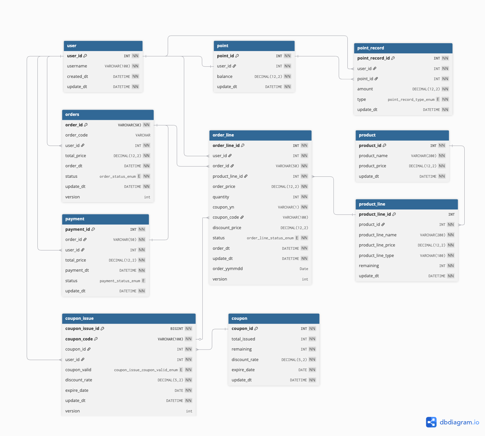

## 초기 설계
<기존 클래스 및 MockAPI를 위한 초기 설계>

## 변경 후 설계
<추후 프로젝트 및 동시성(락) 제어, 기능 완성을 위한 설계>

---

## DB 테이블 및 클래스 설계의 최종 목적

`JPA Entity와 같은 DB리소스와, 도메인 클래스를 분리하여 설계하기.`

- 클래스간 결합도를 낮추기 위해
- 테스트를 용이하게 하기 위해
- JPA에 종속적이지 않은 프로젝트 및 추후 확장을 위한 코드를 위해

> 어떤 ORM이나 DB풀 제공 라이브러리를 사용하더라도 `Entity-Domain` 클래스를 분리하고,   
> 1:N이 발생할 수 있지만, Join과 같은 복잡한 DB의 기능은 코드 레벨에서 해결할 수 있도록하여  
> 덜 종속적이고, 반정규화도 구성하여 DB와 코드를 확실하게 분리하기 위한 구조를 목표로 함. 