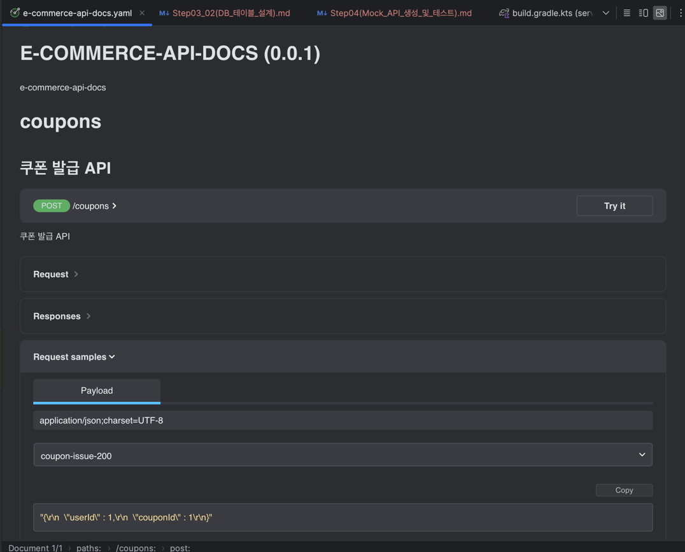

# Step04

## Mock API 란?
> 프론트엔드에서 프로토타입, 테스트 등을 위해 백엔드에 호출하여 사용할 응답을 사전에 제공해서 
> 추후 개발에 대한 파이를 상호 간에 미리 협의하고, Document화 하는 것 ??

=> `실제 비즈니스 로직이나 DB 없이, 프론트엔드 개발·테스트를 위해 미리 정의된 요청/응답 스펙을 제공하는 가짜 API로,
프론트엔드와 백엔드가 API 계약(Contract)을 사전에 합의하고 문서화하기 위한 수단`

---

## Mock API 의 특징
- 프론트엔드 병렬 개발 
  - 백엔드 구현 기다릴 필요 없음 
- API Contract 확정 
  - URL, Method, Request/Response 구조 고정 
- 커뮤니케이션 비용 감소 
  - “이 필드 언제 나와요?” 같은 대화 감소 
- 테스트 & 데모 
  - QA, 기획, PO에게 실제 화면 시연 가능

---

## Mock API를 구성하기 위한 사전 준비
1. Swagger API를 통해, API 명세서 작성
2. Rest Docs를 기반으로, 테스트 코드를 작성하여 코드 레벨의 명세와 UI적 명세를 동시에 완성하기
3. 이를 위한 응답 컨트롤러를 통해 기본 기능 및 구조를 사전에 정의하여 뼈대 갖추기

### 1) Swagger API & Rest Docs 사용 환경 구성
```kotlin
import org.asciidoctor.gradle.jvm.AsciidoctorTask
import org.springframework.boot.gradle.tasks.bundling.BootJar

plugins {
	java
	id("org.springframework.boot") version "3.4.1"
	id("io.spring.dependency-management") version "1.1.7"

	id("org.asciidoctor.jvm.convert") version "3.3.2" // REST Docs Asciidoctor
	id("com.epages.restdocs-api-spec") version "0.17.1" // REST Docs → OpenAPI 3 변환
}

group = "kr.hhplus.be"
version = getGitHash()

java {
	toolchain {
		languageVersion = JavaLanguageVersion.of(17)
	}
}


repositories {
	mavenCentral()
}

dependencies {
    // Test
    testImplementation("org.springframework.boot:spring-boot-starter-test")
	testImplementation("org.springframework.boot:spring-boot-testcontainers")
	testImplementation("org.testcontainers:junit-jupiter")
	testImplementation("org.testcontainers:mysql")
	testRuntimeOnly("org.junit.platform:junit-platform-launcher")

	// REST Docs
	testImplementation("org.springframework.restdocs:spring-restdocs-mockmvc")
	testImplementation("com.epages:restdocs-api-spec-mockmvc:0.17.1")
}


val snippetsDir by extra { file("build/generated-snippets") }
tasks {
	named<Test>("test") {
		outputs.dir(snippetsDir)
		useJUnitPlatform()
		systemProperty("user.timezone", "UTC")

		testLogging{
			showStandardStreams = true
		}

		//systemProperty("testcontainers.disabled", "true")
	}

	// 2) Asciidoctor → HTML 문서 생성
	named<AsciidoctorTask>("asciidoctor") {
		inputs.dir(snippetsDir)
		attributes(mapOf("snippets" to snippetsDir))
		doFirst { delete("src/main/resources/static/docs") }
	}
	// 3) bootJar에 문서 포함
	named<BootJar>("bootJar") {
		dependsOn("asciidoctor")
		doLast {
			copy { from(snippetsDir); into("src/main/resources/static/docs") }
		}
	}
}

extensions.configure<com.epages.restdocs.apispec.gradle.OpenApi3Extension>("openapi3") {
	setServer("https://localhost:8080")
	title = "E-COMMERCE-API-DOCS"
	description = "e-commerce-api-docs"
	version = "0.0.1"
	format = "yaml"
	outputFileNamePrefix = "e-commerce-api-docs"
	outputDirectory = "src/main/resources/static/docs"
}
```

### 2) Rest Docs 작성을 위한 테스트 코드 작성

- 기본 응답 코드 작성 : https://github.com/HangHae-Study/e-commerce-/commit/3ece0115837cd9757a14e98e3dd6e38c9a4dc2f6
- 테스트 코드 : https://github.com/HangHae-Study/e-commerce-/commit/f9fd631f41d7d0cff9ea691e7bbfef583ce7f4d8
- 테스트 실행 후 결과 : https://github.com/HangHae-Study/e-commerce-/blob/main/src/main/resources/static/docs/e-commerce-api-docs.yaml
- Swagger UI : https://raw.githack.com/HangHae-Study/e-commerce-/step04/src/main/resources/static/docs/index.html


---

### 3) 주의사항
import 클래스 명확히 할 것...  `:o`
```java

import static org.springframework.restdocs.mockmvc.MockMvcRestDocumentation.document;
import static org.springframework.restdocs.operation.preprocess.Preprocessors.*;
import static org.springframework.restdocs.payload.PayloadDocumentation.*;
```
